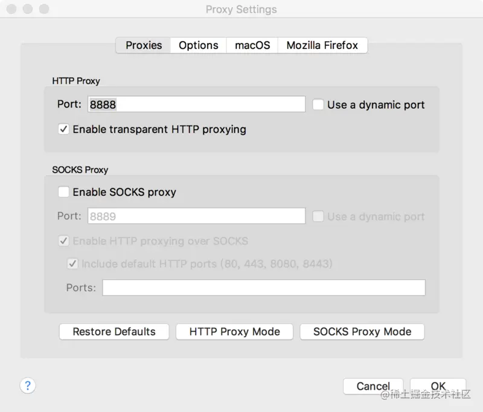
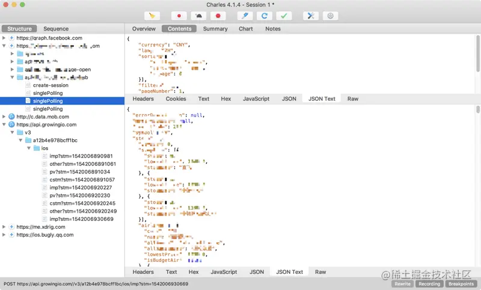

参考链接: https://juejin.cn/post/6844904128104103943

### 1.安装
下载地址 www.charlesproxy.com/download/

选择对应版本安装

### 2.安装好后连接手机

请确保手机和电脑在同一局域网内步骤：设置网络的代理服务器为该电脑的ip地址，端口为8888，此时你已经可以抓取http请求了

此时如果抓包，会看到`https`请求是一堆unknown

### 3.配置抓包HTTPS请求

主要步骤是电脑和手机上都安装好证书

电脑上的配置证书

1）安装Charles HTTPS证书

路径：help–>SSLProxying–> Install Charles Root Ceriticate

2）点击Install Charles Root Ceriticate后，会直接跳到钥匙串

3）如果你的证书已经信任，可直接进入下一步，反之，点击Charles Proxy CA，进入钥匙串访问，设置为始终信任

注意证书过期时间，逾期需要重新安装

4）通过Proxy–>Proxy Settings->Proxies, 勾选Enable transparent HTTP proxying

5）通过Proxy–>SSL Proxying Settings,勾选Enable SSL Proxying, 并添加host，端口是443 这里是把所有的host都设置进去

### 4.手机端下载证书
以下以ios手机演示

1）电脑上通过help–>SSLProxying–> Install Charles Root Ceriticate on a Mobile Device or Remote Browser，可以获得下载提示

2）手机上如`safari`打开上述网址`chls.pro/ssl`(可能会有不同，请看上图提示)，下载安装证书
注意要使用safari，其他浏览器下载证书并不会提示安装

3）信任刚刚安装的证书，手机上打开 设置->通用->关于本机-> 证书信任设置 -> 信任证书

### 重新查看抓包

如果仍然不成功，可以参照以下几点排查

1.手机和电脑不处在同一网络环境下

2.手机上的代理ip不是电脑本机ip

3.证书没装成功

4.没勾选 Proxy -> macOS Proxy，勾选上 macOS Proxy

5.浏览器装的插件拦截了

6.不支持对应的协议，如 https http2 等需要另外配置 
