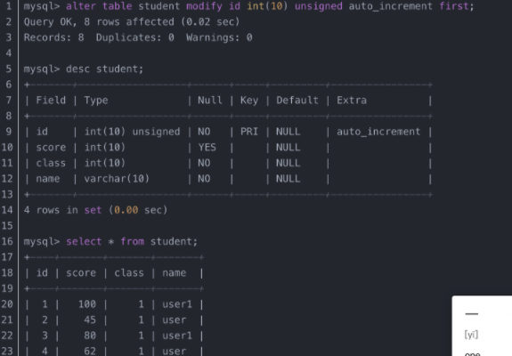

mysql改变列顺序的方法：首先打开数据表；然后把id放在在前面，并且数据不动，语法为:

alter table 表名 modify 字段名 字段类型 after 字段

示例：

创建了一个这样的数据表，想把id放到第一列，因为是主键，并且是自增的：


原来的顺序如上所示，怎么把id放在在前面，并且数据不动，属性不变呢

```
mysql> alter table student modify id int(10) unsigned auto_increment first;
```



这是直接到第一位，要把某字段放在某id之后，可以使用after
```
mysql> alter table student modify name varchar(10) after id;
```


此外，也可以使用change方式修改：

alter table 表名 change 字段名 新字段名 字段类型 默认值 after 字段名(跳到哪个字段之后)

 alter table t1 change z1 rename_z1 varchar(50) default null AFTER z5