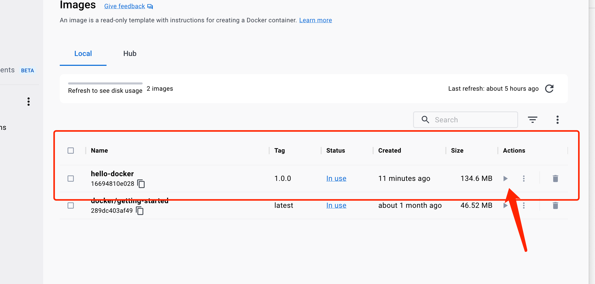
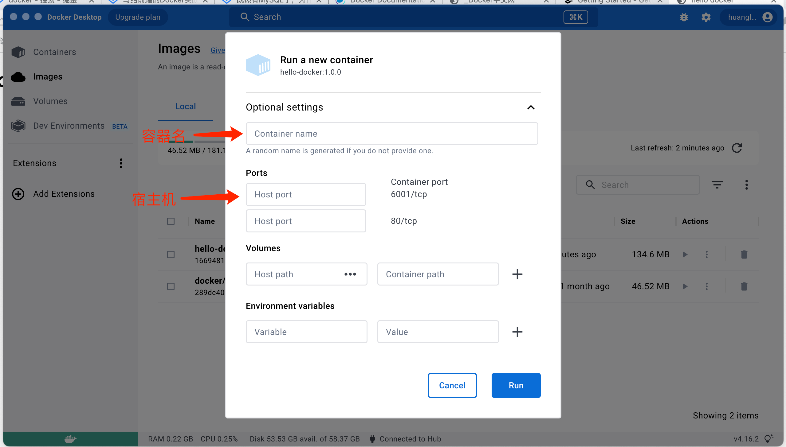

### 1 进入目标目录 
添加`dockerfile`文件, 运行 docker build 命令

语法：docker build [OPTIONS] PATH | URL | -

* PATH: 包含 Dockerfile 的目录路径或 .（当前目录）。
* URL: 指向包含 Dockerfile 的远程存储库地址（如 Git 仓库）。
* -: 从标准输入读取 Dockerfile。
```
docker image build ./ -t hello-docker:1.0.0

// 或者

docker build -t hello-docker:1.0.0 .

// -t 为构建的镜像指定名称和标签 ， `.`或者`./`指定当前目录
```

### 2 将打包完的镜像添加到容器中
```
docker container create -p 6001:80 hello-docker:1.0.0
docker container start xxx # xxx 为上一条命令运行得到的结果
```
在本机浏览器打开 127.0.0.1:6001或者localhost: 6001，你应该能看到刚刚自己写的index.html内容。

在上边第一个命令中，我们使用docker container create来创建基于hello-docker:1.0.0镜像的一个容器，使用-p来指定端口绑定——将容器中的80端口绑定在宿主机的6001端口。执行完该命令，会返回一个容器ID

而第二个命令，则是使用容器ID启动这个容器。

也可以通过 Docker Desktop 点击生成，在镜像列表中找到打包好的项目，点击 actions 下的符号

会出现详情弹窗，可以填写容器名，容器端口与宿主机端口绑定关系，以及一些环境变量等参数，填写完毕点击 Run 就会再容器列表中添加新增一条运行
