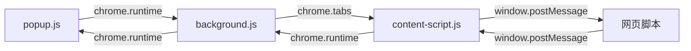

在 Chrome 插件开发中，不同脚本之间的变量无法直接互通，因为它们运行在完全隔离的执行环境中。以下是各组件的关系与通信方式详解：

### 一、核心组件作用域
|**组件**|**执行环境**|**生命周期**|**DOM访问权限**|
|----|----|--|--|
|background.js|插件后台页（独立环境）|插件运行期间持续存在|无法访问网页 DOM|
|content-script.js|注入到网页的隔离环境|随网页加载/卸载|可访问网页 DOM（隔离沙箱|
|popup.js|弹出窗口的独立页面|窗口打开时加载/关闭时销毁|仅访问自身 DOM|

### 二、变量共享规则

1）直接变量互通（不可行）
   
- popup.js ↔ background.js：❌ 无法直接访问
- popup.js ↔ content-script.js：❌ 无法直接访问
- content-script.js ↔ 网页脚本：❌ 沙箱隔离（需通过 window.postMessage）
  
2）官方通信方式


|通信方向|实现方式|代码示例|
|--|--|--|
|popup ↔ background|chrome.runtime.sendMessage + chrome.runtime.onMessage.addListener|js<br>// popup.js<br>chrome.runtime.sendMessage({ action: "getData" });<br>// background.js<br>chrome.runtime.onMessage.addListener((msg) => {...});<br>|
|content-script ↔ background|同上|js<br>// content-script.js<br>chrome.runtime.sendMessage({ type: "fromContent" });<br>
|popup ↔ content-script|通过 chrome.tabs.sendMessage 指定 Tab ID|js<br>// popup.js<br>chrome.tabs.sendMessage(tabId, { data: "hello" });<br>|
|content-script ↔ 网页脚本|window.postMessage + 事件监听|js<br>// content-script.js<br>window.postMessage({ type: "fromContent" }, "*");<br>// 网页脚本<br>window.addEventListener("message", (e) => {...});<br>|

### 三、数据共享替代方案

1）存储共享
```js
// 所有组件均可读写
chrome.storage.local.set({ key: "value" });
chrome.storage.local.get("key", (result) => {
  console.log(result.key);
});
```
2）全局变量传递（仅限 background）
```js
// background.js
let globalData = {};

// popup.js 通过消息获取
chrome.runtime.sendMessage({ cmd: "getGlobalData" }, (response) => {
  console.log(response.data);
});
```
### 完整通信流程图

### 五、最佳实践

1.轻量通信：优先使用 `chrome.runtime.sendMessage` 短消息

2.大数据传递：使用 chrome.storage 或 IndexedDB

3.安全过滤：验证消息来源

```javascript
chrome.runtime.onMessage.addListener((msg, sender, sendResponse) => {
  if (sender.id !== chrome.runtime.id) return; // 验证插件ID
});
```
### 六、调试技巧

查看各环境控制台：

- 后台页：chrome://extensions → 点击插件背景页链接

- 内容脚本：网页控制台中选择 isolated world

- 弹出页：右键插件图标 → 审查弹出内容

日志标记：

```javascript
console.log("[Background] Event received");
```
通过正确使用 Chrome API 的通信机制，可以实现插件各组件间的高效数据交互。