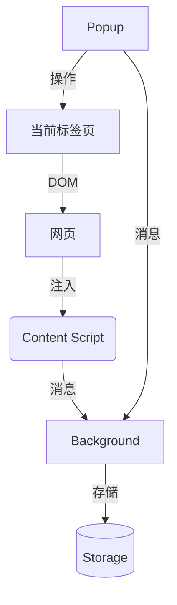

## 一、基础目录结构
```
my-extension/
├── manifest.json          # 插件配置文件（核心）
├── icons/                 # 插件图标
│   ├── icon16.png         # 16x16
│   ├── icon48.png         # 48x48
│   └── icon128.png        # 128x128
├── background/            # 后台脚本
│   └── service-worker.js  # 后台 Service Worker
├── content/               # 内容脚本
│   └── content-script.js  
├── popup/                 # 弹出窗口
│   ├── popup.html
│   ├── popup.css
│   └── popup.js
├── options/               # 配置页面（可选）
│   ├── options.html
│   ├── options.css
│   └── options.js
└── _locales/              # 多语言配置（可选）
    └── en/
        └── messages.json
```

## 二、核心文件详解

### 1. manifest.json (必需)

```json
{
  "manifest_version": 3,    // 必须为3（最新规范）
  "name": "My Extension",
  "version": "1.0.0",
  "description": "示例插件描述",
  
  "icons": {
    "16": "icons/icon16.png",
    "48": "icons/icon48.png",
    "128": "icons/icon128.png"
  },

  "permissions": [
    "storage",           // 本地存储权限
    "activeTab",         // 当前标签页权限
    "scripting"          // 脚本注入权限
  ],

  "host_permissions": ["https://*/*", "http://*/*"], // 支持哪些域名网址下可使用脚本功能 * 表示不作限制

  "background": {
    "service_worker": "background/service-worker.js"
  },

  "content_scripts": [{
    "matches": ["https://*.example.com/*"], // 可根据域名网址加载不同的html资源
    "js": ["content/content-script.js"],
    "css": ["content/content-style.css"]
  }],

  "action": {
    "default_popup": "popup/popup.html",
    "default_icon": {
      "16": "icons/icon16.png",
      "48": "icons/icon48.png"
    }
  },

  "options_page": "options/options.html"  // 可选配置页
}
```

### 2. service-worker.js（后台脚本）

```javascript
// 持久化监听事件
chrome.runtime.onInstalled.addListener(() => {
  console.log('插件已安装');
    // 创建右键菜单子项 scrapePlugin
  	chrome.contextMenus.create({
		id: "scrapePlugin",
		title: "扫描商品",
		contexts: ["page", "selection"], // 在[页面,选中文本]时显示
	});
});

// 监听右键菜单点击，如果选择 scrapePlugin 执行对应脚本
chrome.contextMenus.onClicked.addListener(async (info, tab) => {
	if (info.menuItemId === "scrapePlugin") {
		try {
            // 执行目标js文件
			await chrome.scripting.executeScript({
				target: { tabId: tab.id },
				files: ["content-script.js"],
			});
			console.log("Content script injected successfully!");
		} catch (error) {
			console.error("Failed to inject content script:", error);
		}
	}
});

// 消息通信处理
chrome.runtime.onMessage.addListener((message, sender, sendResponse) => {
  if (message.action === 'getData') {
    chrome.storage.local.get('key', (data) => {
      sendResponse(data);
    });
    return true; // 保持消息通道开放
  } 
});

// Chrome 并不会提供 onUninstalled 的监听（因为插件被卸载时无法再运行），但你可以使用 chrome.runtime.setUninstallURL() 设置一个卸载跳转地址, 让用户卸载后自动访问某页面
chrome.runtime.setUninstallURL("https://yourdomain.com/uninstalled-feedback");
```

### 3. content-script.js（内容脚本）

```javascript
// 与网页 DOM 交互
document.addEventListener('click', (e) => {
  chrome.runtime.sendMessage({
    type: 'elementClicked',
    target: e.target.tagName
  });
});

// 接收后台消息
chrome.runtime.onMessage.addListener((msg) => {
  if (msg.action === 'highlight') {
    document.body.style.backgroundColor = 'yellow';
  }
});
```

### 4. popup.html（弹出窗口）

```html
<!DOCTYPE html>
<html>
<head>
  <link rel="stylesheet" href="popup.css">
</head>
<body>
  <h1>插件控制面板</h1>
  <button id="btn">执行操作</button>
  <script src="popup.js"></script>
</body>
</html>
```

### 5. popup.js（弹出窗口逻辑）

```javascript
document.getElementById('btn').addEventListener('click', async () => {
  // 与后台通信
  const [tab] = await chrome.tabs.query({ active: true });
  
  chrome.scripting.executeScript({
    target: { tabId: tab.id },
    func: () => {
      alert('操作已执行!');
    }
  });
});
```

## 三、核心功能模块关系



## 四、开发注意事项

权限控制：

- 遵循最小权限原则（manifest.json的permissions字段）

- 需要敏感权限（如<all_urls>）需在插件说明中声明

调试方法：

- 内容脚本：直接使用网页开发者工具

- 后台脚本：访问 chrome://extensions → 点击插件背景页链接

- 弹出窗口：右键插件图标 → 审查弹出内容

数据存储：

- 小数据：使用 chrome.storage.local

- 大数据：推荐 IndexedDB

更新策略：

- 避免频繁更新（Chrome Web Store审核需时间）

- 使用 chrome.runtime.onUpdateAvailable 监听更新

## 五、典型项目结构扩展（可选）

```
目录/文件	用途
utils/	公共工具函数
styles/	全局样式文件
assets/	图片/字体资源
tests/	单元测试/集成测试
webpack.config.js	构建配置（复杂插件需要）
```

## 六、推荐开发流程

1. 创建 manifest.json 基础配置

2. 添加权限声明（按需增加）

3. 开发内容脚本 → 测试DOM操作

4. 现后台逻辑 → 测试消息通信

5. 构建用户界面（Popup/Option页）

6. 添加数据存储功能

7. 进行跨浏览器测试（如需支持Firefox等）

此结构符合 Chrome Extension Manifest V3 规范，支持现代浏览器插件开发需求。实际开发中可根据项目复杂度调整模块划分。