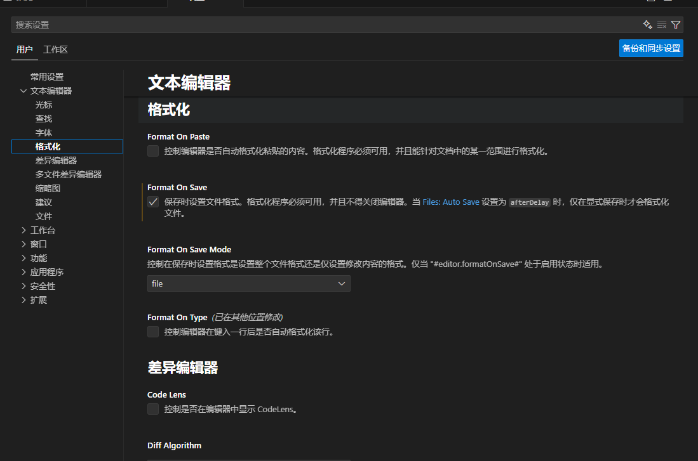

前端主要使用 eslint + prettier 控制代码规范，其中 eslint 主要用于代码检查，prettier 则是编码格式问题，俩者之间存在一定交集，所以通常会通过 `eslint-config-prettier`和 `eslint-plugin-prettier` 来扩展 eslint ，使其兼容 prettier 相关配置，消除冲突、消除报错

此外需要注意，不仅项目中的 eslint 脚本可以触发 prettier 格式化代码文件；编辑器中也可以设置编码格式，比如在 vscode 商店中安装 prettier 和 eslint 插件后、在设置中启用 formateOnSave 为 `true` 和使用 `prettier` 格式化后，就可以在保存文件时触发代码格式化。



也可以通过在项目根目录添加 `.vscode/settings` 文件，主动设置保存格式

.vscode/setting.json 示例

```json
{
  "editor.defaultFormatter": "esbenp.prettier-vscode",

  "editor.formatOnSave": true,

  "files.autoSave": "onFocusChange",

  "[javascript]": {
    "editor.defaultFormatter": "esbenp.prettier-vscode"
  },
  "[typescript]": {
    "editor.defaultFormatter": "esbenp.prettier-vscode"
  },
  "[vue]": {
    "editor.defaultFormatter": "esbenp.prettier-vscode"
  },
  "[json]": {
    "editor.defaultFormatter": "esbenp.prettier-vscode"
  },
  "[html]": {
    "editor.defaultFormatter": "esbenp.prettier-vscode"
  },
  "[css]": {
    "editor.defaultFormatter": "esbenp.prettier-vscode"
  },
  "[scss]": {
    "editor.defaultFormatter": "esbenp.prettier-vscode"
  },
  "[markdown]": {
    "editor.defaultFormatter": "esbenp.prettier-vscode"
  },

  "editor.codeActionsOnSave": {
    "source.fixAll.eslint": true
  },

  "eslint.validate": [
    "javascript",
    "javascriptreact",
    "typescript",
    "typescriptreact",
    "vue"
  ]
}
```

三者优先级：

- 项目文件夹设置（.vscode/settings.json）优先级最高，只影响当前项目。
- 工作区设置（如果你打开的是多文件夹工作区，工作区 settings 优先于用户设置）。
- 用户设置（全局 settings.json），影响所有项目，但会被上面两者覆盖。

优先级顺序： 项目文件夹设置 > 工作区设置 > 用户设置
