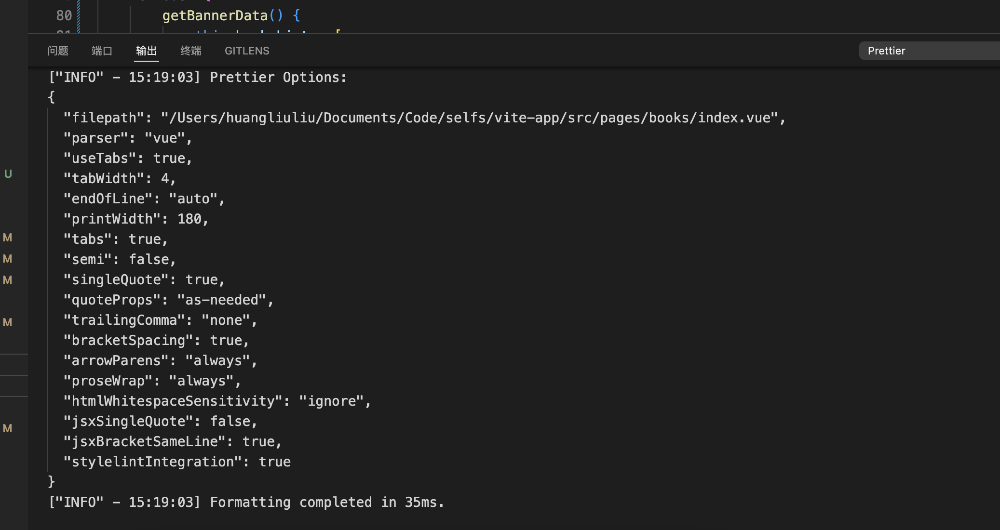

# Prettier

代码格式工具，官网地址：https://www.prettier.cn

## 1 安装

`npm i prettier - D`

## 2 配置文件
- 项目根目录下以 JSON 或 YAML 编写的文件.prettierrc
  `.prettierrc.json`、`.prettierrc.yml`、`.prettierrc.yaml`或`.prettierrc.json5`文件
-  使用导出对象`module.exports`的js文件
  、`.prettierrc.cjs`、`prettier.config.js`
- `package.json` 中的 `prettier` 字段
  
## 3 `.prettierignore`
  在该文件中设置不被`prettier`检查的文件或文件夹,如：
  ```
  /node_modules
  /dist
  ```
## 保存感知
每次保存代码，会在终端的输出拦下有打出


## 实际问题

- 1 当项目首次安装prettier后，运行项目会出现提示prettier的相关报错，如:

  `Line 16:9:  Delete `⏎↹↹↹↹⏎↹↹↹`  prettier/prettier`

  应该是首次安prettier后，应是其检测到项目中有代码格式不符合配置规则，按照报错提示到目标文件修改、若编辑器设置了保存自动格式文件代码可直接在该页面<font color='red'>保存</font>操作
- 2 若安装后，保存文件没有格式化文件，请检查 VScode 设置，是否配置了 formatOnSave 为 false

VS Code 设置优先级如下：

- 项目文件夹设置（.vscode/settings.json）优先级最高，只影响当前项目。
- 工作区设置（如果你打开的是多文件夹工作区，工作区 settings 优先于用户设置）。
- 用户设置（全局 settings.json），影响所有项目，但会被上面两者覆盖。

优先级顺序：
项目文件夹设置 > 工作区设置 > 用户设置

.vscode/setting.json
```json
{
  "editor.defaultFormatter": "esbenp.prettier-vscode",
  
  "editor.formatOnSave": true,
  
  "files.autoSave": "onFocusChange",
  
  "[javascript]": {
      "editor.defaultFormatter": "esbenp.prettier-vscode"
  },
  "[typescript]": {
      "editor.defaultFormatter": "esbenp.prettier-vscode"
  },
  "[vue]": {
      "editor.defaultFormatter": "esbenp.prettier-vscode"
  },
  "[json]": {
      "editor.defaultFormatter": "esbenp.prettier-vscode"
  },
  "[html]": {
      "editor.defaultFormatter": "esbenp.prettier-vscode"
  },
  "[css]": {
      "editor.defaultFormatter": "esbenp.prettier-vscode"
  },
  "[scss]": {
      "editor.defaultFormatter": "esbenp.prettier-vscode"
  },
  "[markdown]": {
      "editor.defaultFormatter": "esbenp.prettier-vscode"
  },

  "editor.codeActionsOnSave": {
      "source.fixAll.eslint": true
  },
  
  "eslint.validate": [
      "javascript",
      "javascriptreact",
      "typescript",
      "typescriptreact",
      "vue"
  ]
}
```
如果当前项目 中设置 的是false，保存时还是可以格式化文件

出现这种情况的常见原因有：

- 全局设置覆盖：你的用户设置（全局 settings.json）可能设置了 editor.formatOnSave: true，全局设置会被项目设置覆盖，但某些插件或语言特定设置可能会优先于项目设置。

- 插件自动格式化：如 Prettier、ESLint、Volar 等插件，可能有自己的“保存时自动格式化”选项（如 prettier.formatOnSave），即使 VS Code 的 editor.formatOnSave 为 false，插件依然会格式化。

- 语言特定设置：在 settings.json 里可能有类似如下配置：

```
"[vue]": {
  "editor.formatOnSave": true
}
```

这种情况下，保存 Vue 文件时会格式化。

- VS Code 远程或多窗口环境：有时远程开发或多窗口会导致设置未生效。

排查建议：

- 检查全局 settings.json 是否有相关设置。
- 检查是否安装了自动格式化相关插件，并查看它们的设置。
- 检查是否有针对特定语言的格式化设置。
- 关闭所有 VS Code 窗口，重新打开项目。


## 拓展插件

"prettier-plugin-organize-imports" 保存代码时自动删除已声明但从未读取其值的变量
```
{
  "printWidth": 80,
  "singleQuote": true,
  "trailingComma": "all",
  "proseWrap": "never",
  "overrides": [{ "files": ".prettierrc", "options": { "parser": "json" } }],
  "plugins": ["prettier-plugin-organize-imports", "prettier-plugin-packagejson"]
}
```