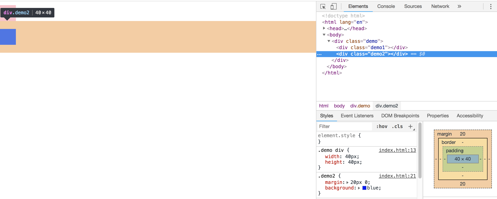

BFC(块格式化上下文): 是Web页面可视化渲染CSS的一部分, 是布局过程中生成块级盒子的区域。也是浮动元素与其他元素的交互限定区域。

1.解决普通文档流块元素的外边距折叠问题

```html
 <style>
    * {
        margin: 0;
        padding: 0;
    }
    .demo div {
        width: 40px;
        height: 40px;
    }
    .demo1 {
        margin: 10px 0;
        background: pink;
    }
    .demo2 {
        margin: 20px 0;
        background: blue;
    }
</style>
<div class="demo">
    <div class="demo1"></div>
    <div class="demo2"></div>
</div>
```

使用BFC把俩个元素进行隔离
```html
<style>
    * {
        margin: 0;
        padding: 0;
    }
    .demo {
        overflow: hidden;
    }
    .demo div {
        width: 40px;
        height: 40px;
    }
    .demo1 {
        margin: 10px 0;
        background: pink;
    }
    .demo2 {
        margin: 20px 0;
        background: blue;
    }
</style>

<div class="demo">
    <div class="demo1"></div>
</div>
<div class="demo">
    <div class="demo2"></div>
</div>
```
或者使用 overflow:hidden 清楚浮动

触发BFC
1. 根元素或包含根元素的元素
2. 浮动元素（元素的 float 不是 none）
3. 绝对定位元素（元素的 position 为 absolute 或 fixed）
4. 行内块元素（元素的 display 为 inline-block）
5. 表格单元格（元素的 display为 table-cell，HTML表格单元格默认为该值）
6. 表格标题（元素的 display 为 table-caption，HTML表格标题默认为该值）
7. 匿名表格单元格元素（元素的 display为 table、table-row、 table-row-group、table-header-group、table-footer-group（分别是HTML table、row、tbody、thead、tfoot的默认属性）或 inline-table）
8. overflow 值不为 visible 的块元素
9. display 值为 flow-root 的元素
10. contain 值为 layout、content或 strict 的元素
11. 弹性元素（display为 flex 或 inline-flex元素的直接子元素）
12. 网格元素（display为 grid 或 inline-grid 元素的直接子元素）
13. 多列容器（元素的 column-count 或 column-width 不为 auto，包括 column-count 为 1）
14. column-span 为 all 的元素始终会创建一个新的BFC，即使该元素没有包裹在一个多列容器中（标准变更，Chrome bug）。
