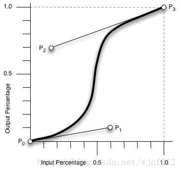
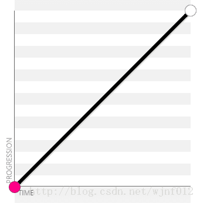
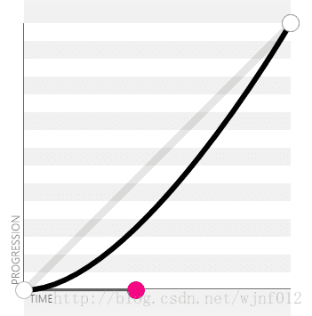
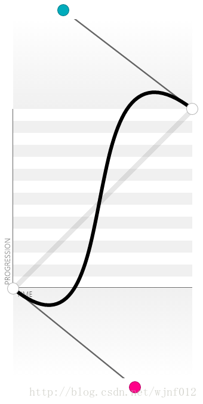

在animation和transition两个属性中，cubic-bezier是控制变化的速度曲线，下面我们来了解下什么是cubic-bezier。
cubic-bezier称为三次贝塞尔曲线，主要是生成速度曲线的函数，规定是cubic-bezier(<x1>,<y1>,<x2>,<y2>) .

模拟地址:  http://web.chacuo.net/css3beziertool/

从上图中我们可以看到，cubic-bezier有四个点：两个默认的，即：P0(0,0)，P3(1,1)；两个控制点，即：P1(x1,y1)，P2(x2,y2)注：X轴的范围是0~1，超出cubic-bezier将失效，Y轴的取值没有规定，但是也不宜过大，最好也在0~1。我们只要调整两个控制点P1和P2的坐标，最后形成的曲线就是动画曲线。

下面以我们常用到的曲线为例：1、linear，即cubic-bezier(0,0,1,1) / cubic-bezier(1,1,0,0)，左边cubic-bezier曲线，右边浏览器动画曲线展示。下同。

2、ease，即cubic-bezier(0.25,0.1,0.25,1)。

3、ease-in，即cubic-bezier(0.42,0,1,1)。

4、ease-out，即cubic-bezier(0,0,0.58,1)。

5、ease-in-out，即这里写代码片。

6、随机示例1：cubic-bezier(0.68,-0.55,0.27,0.55)。

