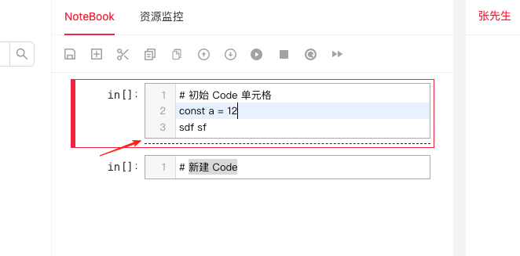
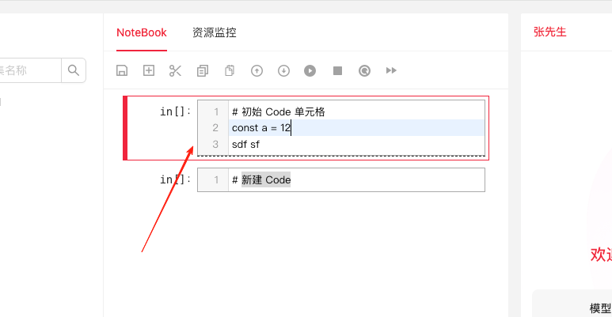

一个元素高度比子元素高度多了6px,父元素并未设置高度，也没有发现`padding`、`margin`异常



之后尝试

```css
/* 在父元素上尝试 */
font-size: 0;  /* 消除文字间隙 */
line-height: 1; /* 重置行高 */

/* 在子元素上尝试 */
display: block; /* 或其他适合的显示模式 */
vertical-align: top; /* 对齐方式可能影响高度 */
```
6px的空白被消除



发现是子元素设置了 `display` 为 `inline-block`

inline-block 的特点:
- 会受到文字基线（baseline）的影响
- 默认会有一个文字间距（类似于空格）
- 对 vertical-align 属性敏感
- 容易出现不需要的间隙和对齐问题
  
将 `display` 改动到 `flex` 或者 `block`