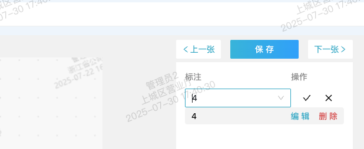
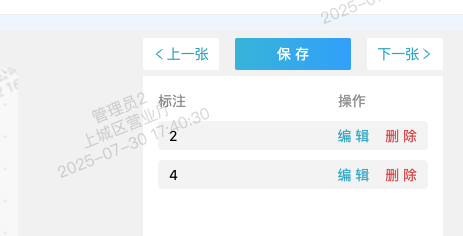
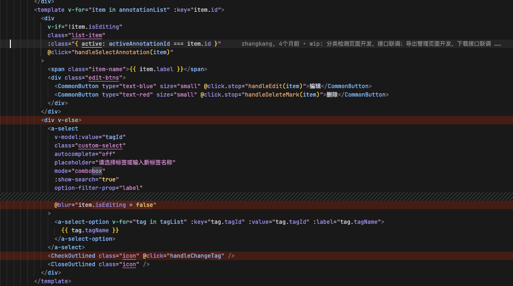
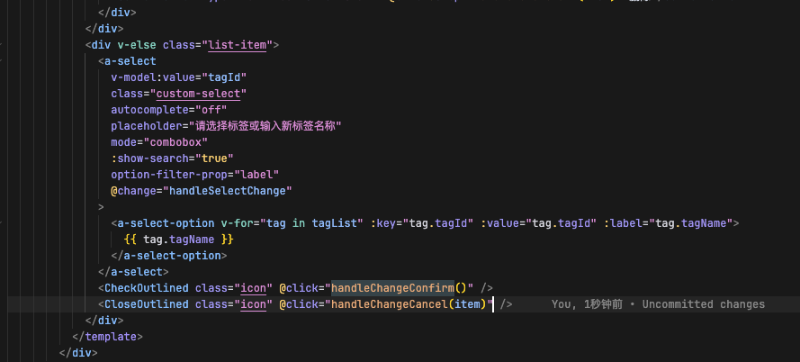

在实际开发中，碰到选择框切换选项后绑定数据没有更新的情况:

切换中：

确认后：

查阅项目代码发现，选择框没有绑定change事件且有绑定`blur`事件判断选择框是否展示：

在 `JavaScript` 中，`blur` 事件会在 `click` 事件之前触发(这是由事件冒泡和浏览器的事件处理机制决定的)。上述代码中，输入框与展示文案是互斥展示的，当更改 `item.isEditing` 值，会偶现展示文案值没有更新。这是因为点击 `CheckOutlined` 元素 会优先执行输入框的`blur`事件导致整个 `v-else`区域被销毁，`CheckOutlined`自身的`click`事件不被执行，最终展示成展示文案与选择框值不同步的情况。

调整代码后，就能同步更新了：

