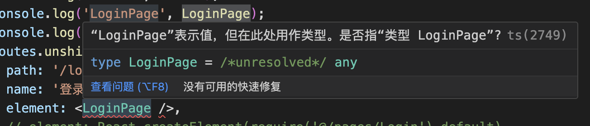
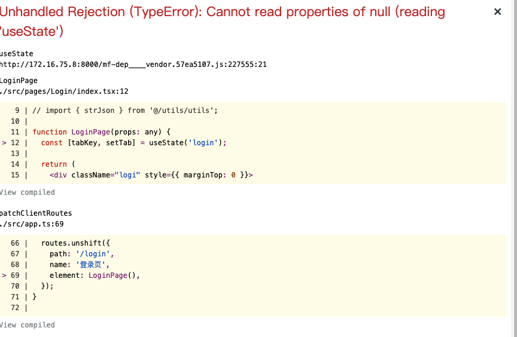
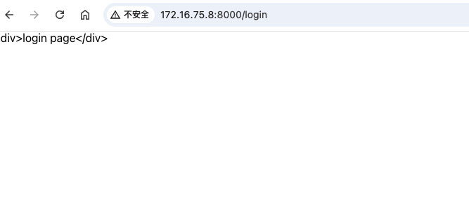

### umi4动态导入路由：

umi4 中除了在`config/config.ts`中配置`routes`，也可以在 `app.tsx` 中使用 `patchClientRoutes` 动态加入路由，适用于根据后端接口按需导入路由

```tsx
// src/app.tsx 官方demo
import Page from '@/extraRoutes/foo';

export function patchClientRoutes({ routes }) {
  routes.unshift({
    path: '/foo',
    element: <Page />, 
  });
}
```
我们按照官方示例使用
```tsx
import LoginPage from '@/pages/Login/index';

export function patchClientRoutes({ routes }) {
  routes.unshift({
    path: '/login',
    element: <LoginPage />, 
  });
}
```
服务为启动失败



LoginPage 不能直接作为子节点，需要是调用结果

```tsx
export function patchClientRoutes({ routes }) {
  routes.unshift({
    path: '/login',
    element: LoginPage, 
  });
}
```

提示： Warning: Functions are not valid as a React child. This may happen if you return a Component instead of <Component /> from render. Or maybe you meant to call this function rather than return it.

LoginPage是一个函数，尝试传入其运行结果

```tsx
export function patchClientRoutes({ routes }) {
  routes.unshift({
    path: '/login',
    element: LoginPage(), 
  });
}
```


LoginPage中有使用react钩子，element属性下并不支持，测试一下 `element` 支持展示 html 内容吗 
```tsx
export function patchClientRoutes({ routes }) {
  routes.unshift({
    path: '/login',
    element: '<div>login page</div>', 
  });
}
```


根据测试结果，我们可以通过 react 中的 `createElement` 来转译函数组件给 `element`使用
```tsx
import LoginPage from '@/pages/Login/index';
import React from 'react';

export function patchClientRoutes({ routes }: any) {
  routes.unshift({
    path: '/login',
    name: '登录页',
    element: React.createElement(LoginPage), 
    // require('@/pages/Login').default 等价于 LoginPage
    //  element: React.createElement(require('@/pages/Login').default), 
  });
}
```


页面展示成功