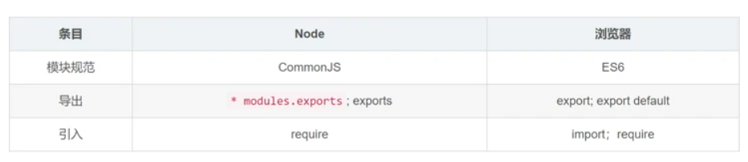

### commonJS 
参考：链接：https://juejin.cn/post/6938581764432461854

导出使用 <code>module.exports</code> 或 <code>exports</code>, 引入则是 require

```js
// 导出 index.js
exports.from = 'sc' // 单个导出值
module.exports = {
    name: 'hliuliu',
    age: 25
} // 导出一个对象

// 引入
const data = require('./index.js')
console.log(data) // {from: 'sc',name: 'hliuliu',age: 25}
```
- 支持文件动态导入
```js
const targets = ['./index.js','./public/index.js']
lists.forEach= ((url) => require(urk))
```
- 相同文件不会重复导入
```js
let data = require("./index.js")
let data = require("./index.js") // 不会在执行了
```
- 导入值的变化
```js
// index.js
let num = 0;
module.exports = {
    num,
    add() {
       ++ num 
    }
}


let { num, add } = require("./index.js")
console.log(num) // 0
add()
console.log(num) // 0
num = 10
```
exports导出的值是值的拷贝，更改完++ num值没有发生变化，并且导入的num的值我们也可以进行修改


### module

导出使用 <code>export</code> 或 <code>exports.default</code>, 引入则是 import

```js
// 变量分开导出 index.js
export const name = 'hliuliu'
export const age = 25
export const add = () = {
    age+=1
}
// or 
const name = 'hliuliu'
const age = 25
export {name,age}


// 整体导出 userInfo.js
export default {
    name: 'hliuliu',
    age: 25
}
```

- 混合导出
  
可以使用export和export default同时使用并且互不影响，只需要在导入时地方注意，如果文件里有混合导入，则必须先导入默认导出的，在导入单个导入的值。

- 导入
```js
import {name,age} from './index.js' // 针对单个变量导出
import * from './userInfo.js' // 全部导入 name,age

import userInfo from './userInfo.js' // 整体导出
import * as all from './userInfo.js' // 别名导入
```
- 混合导入
```js
// index,js
export const name = "蛙人"
export const age = 24
export default {
    msg: "蛙人"
}

import msg, { name, age } from './index.js'
console.log(msg) // { msg: "蛙人" }

// 可以起别名
import { default as all,  name, age } from './index.js'
console.log(all) // { msg: "蛙人" }
```
- 导出、引入一起写，在 TypeScript (.ts 或 .tsx 文件) 中，不支持直接导出和引入外部链接。
```js
export * from '/common.js'
```
- 导入值的变化
  
导出的值是值的引用，并且内部有映射关系，这是export关键字的作用。而且导入的值，不能进行修改也就是只读状态。
```js
// index.js
export let num = 0;
export function add() {
    ++ num
}

import { num, add } from "./index.js"
console.log(num) // 0
add()
console.log(num) // 1
num = 10 // 抛出错误
```
Module是静态导入，不支持commonjs中的动态导入

### 总结
