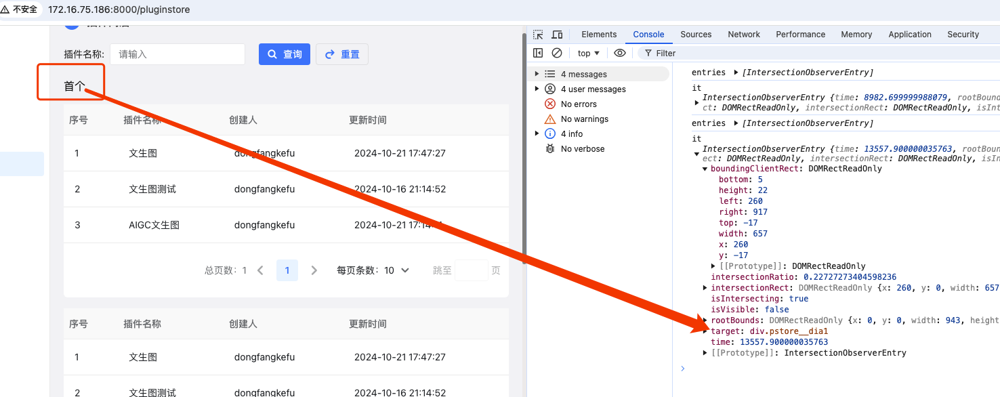

### intersecionObserver

MDN链接：https://developer.mozilla.org/zh-CN/docs/Web/API/IntersectionObserver/IntersectionObserver

一种异步观察目标元素与其祖先元素或顶级文档视口（viewport）交叉状态的方法

语法：
var observer = new IntersectionObserver(callback[, options]);

callback 是可见比例超过阀值会执行的回调，接受俩个参数 entries 和 observer；

- entries：一个IntersectionObserverEntry对象的数组，每个被触发的阈值

- observer：被调用的实例


options： 

- root: 指定祖先元素，监听元素的祖先元素Element对象，其边界盒将被视作视口。目标在根的可见区域的任何不可见部分都会被视为不可见。如果未传入 root 或其值为null，则默认使用顶级文档的视口。

- rootMargin：一个在计算交叉值时添加至根的边界盒 (bounding_box) 中的一组偏移量，类型为字符串 (string) ，可以有效的缩小或扩大根的判定范围从而满足计算需要，默认值是"0px 0px 0px 0px"。

- thresold: 规定了一个监听目标与边界盒交叉区域的比例值，若指定值为 0.0，则意味着监听元素即使与根有 1 像素交叉，此元素也会被视为可见。若指定值为 1.0，则意味着整个元素都在可见范围内时才算可见,可以是一个具体的数值或是一组 0.0 到 1.0 之间的数组,默认值为 0.0。thresold 是一个绝对值，适用于从窗口顶部移入可视区域，也适用于从窗口底部移入可视区域。
```html
<div className="pstore__dia1">首个</div>
……
<div className="pstore__dia1">首个2</div>
```
```js
  function handleObserver() {

    const initObserver = new IntersectionObserver((entries, observer) => {
      entries.forEach((it) => {
        console.log('it', it);
      });
    });
    const elements = document.querySelectorAll('.pstore__dia1');
    // observe 只能接受单个元素
    // 监听单个元素
    // initObserver.observe(elements[0]);
    // 监听多个目标元素
    elements.forEach((e) => {
      initObserver.observe(e);
    });
  }
```


相比于 js 监听页面滚动比较元素 offsetTop、scrollTop 或是 getBoundingClientRect 值是否出现在可视区域方法。不需要使用监听 API，减少js资源计算，减少内存使用，不回造成页面渲染堵塞。