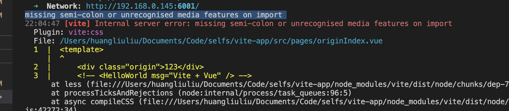

### missing semi-colon or unrecognised media features on import




注意：@import "${path.resolve(__dirname, 'src/assets/css/global.less')}";结尾处的;不能省略，否则会报错：# missing semi-colon or unrecognised media features on import

```js
    css: {
        preprocessorOptions: {
            less: {
                // globalVars: {
                //     blue: "#1CC0FF",
                // },
                javascriptEnabled: true,
                additionalData: `@import "@/assets/styles/common.less";`,
                // additionalData: `@import "${pathResolve(
                //     "src/assets/styles/common.less",
                // )}";`,
            },
        },
    },
```

可以任务是在为每个 less 文件预先引入了 
<code>
@import url(@/assets/styles/common.less);
</code>
