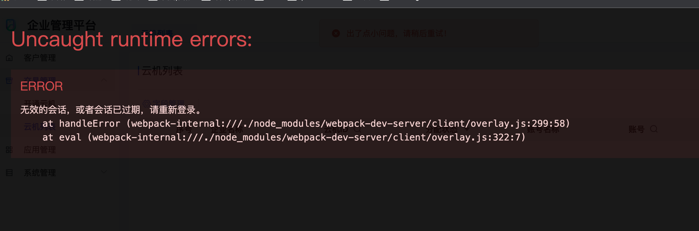

### 问题说明
处理 `Promise.rejcet()` 返回一个已被拒绝的 Promise 对象，并将指定的原因作为拒绝的值。如果没有 catch 函数捕获不过可能会报错

- ps：针对`axios`接口统一处理500返回
```js
axios.js: 
// 创建axios实例 process.env.VUE_APP_BASE_API '/base-api'
const service = axios.create({
	// axios中请求配置有baseURL选项，表示请求URL公共部分
	baseURL: BASE_PATH,
	// 超时
	timeout: 10000
})

service.interceptors.response.use(
	res => {
		// 未设置状态码则默认成功状态
		const code = res.data.code || 200
        if (code !== 200) {
			return Promise.reject('error')
		} else {
			return res.data
		}
	},
	error => {
        ………………
	}
)

页面调用：
async function getTypes() {
    const back = await openType()
    console.log('枚举信息', back)
}
```

页面中调用时，没有catch去接口被拒绝访问的promise对象，可能会报错。项目开发环境被 `webpack-dev-server` 弹窗提示:



### 处理

1. 检查 webpack-dev-server
   
- 检查配置文件：确保webpack-dev-server的配置文件正确无误。检查是否有任何语法错误或配置问题可能导致此错误。

- 更新webpack-dev-server版本：检查您的项目中使用的webpack-dev-server版本。如果它是一个较旧的版本，尝试升级到最新版本，因为新版本可能修复了一些已知的问题。

- 查看错误堆栈跟踪：通过查看更完整的错误堆栈跟踪信息，可以获取更多关于发生错误的上下文和线索。在浏览器中打开开发者工具，查看控制台输出和其他可能的错误消息。

- 搜索相关文档和社区支持：搜索相关的错误消息和堆栈跟踪，查看是否有其他人遇到过类似的问题，并找到相应的解决方案或建议

2. 页面接口调用包裹一层 try……catch
```
try {
    // 接口调用
} catch (err) {
    // 
}
```

3. promise.reject 针对性使用，不要广泛处理