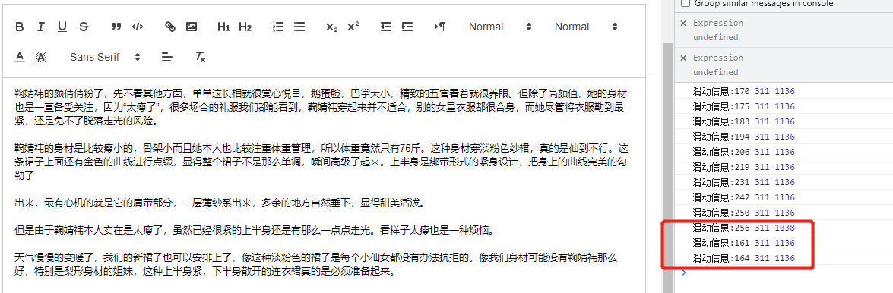

javaScript 后期将元素状态修改为fixed布局，会导致页面文档高度发生改变，如出现抖动等不好情况，如/wemedia一刻后台自媒体……，
也可以使用sticky粘贴的方法，但是改后台由于嵌套了多层父标签添加过多relative属性也不好，所以还是保留使用fixed+保持页面文档高度不变的方法实现富文本编辑栏吸顶的效果

更改前，特定滚动时达不到吸顶效果



更改后：

```js
    mounted() {
        // this.getDetailInfo();
        window.addEventListener("scroll", this.changeFixed, true);
    },
    destroyed() {
        window.removeEventListener("scroll", this.changeFixed, true);
    },
    
    methods:{     
        ……
        changeFixed() {
            let targetObj = document.getElementsByClassName("ql-toolbar");
            // 不处于内容编辑中时不进行判断
            if (!this.isEdit) {
                return;
            }
            if (!targetObj[0]) {
                // console.log("滚动监听targetObj:%o", targetObj);
                return;
            }
            // 有定义中级 el-main
            let scrollHeight =
                document.getElementsByClassName("el-main")[0].scrollTop ||
                document.documentElement.scrollTop ||
                window.pageYOffset ||
                document.body.scrollTop;
            let fatherTop = document.getElementById("fixPosition").parentElement
                .parentElement.offsetTop;
            let diWidth = document.getElementById("fixPosition").offsetWidth;
            // fixed 会导致文档高度改变 document.getElementsByClassName("el-main")[0].scrollHeight
            // 改变fixed后还得保证实际高度不变 避免出现抖动
            let diHeight = targetObj[0].offsetHeight;
            if (targetObj[0].offsetParent && scrollHeight > fatherTop - 60) {
                targetObj[0].style.cssText = `position:fixed;top:60px;z-index:101;background:rgba(255,255,255,1);width:${diWidth}px`;
                document.getElementById(
                    "fixPosition"
                ).style.cssText = `padding-top:${diHeight}px`;
                // document.querySelector("container").style.paddingTop = "60px";
            } else if (
                targetObj[0].offsetTop &&
                scrollHeight > fatherTop - 60
            ) {
                // targetObj[0].style.width = `${setWidth}px`;
                targetObj[0].style.cssText = `position:fixed;top:60px;z-index:101;background:rgba(255,255,255,1);width:${diWidth}px`;
                document.getElementById(
                    "fixPosition"
                ).style.cssText = `padding-top:${diHeight}px`;
            } else {
                document.getElementById(
                    "fixPosition"
                ).style.cssText = `padding-top:0px`;
                targetObj[0].style.cssText = `position:static;width:${diWidth}`;
            }
            // fixed 会导致文档高度改变 document.getElementsByClassName("el-main")[0].scrollHeight
            // scrollHeight 内容高度
            console.log(
                "滑动信息:%s",
               scrollHeight,
                fatherTop,
                document.getElementsByClassName("el-main")[0].scrollHeight
             );
        },
        ……
        }
```
