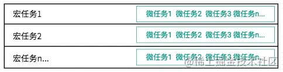

在JavaScript 中，任务执行机制采用的是事件循环（event loop）机制。 在执行上下文中，有调用栈(先进后出)和任务队列（先进先出），调用栈用于存放同步任务的执行上下文，而任务队列则用于存放异步任务的回调函数。 异步任务分为宏任务和微任务，其执行顺序不同，通过根据事件循环机制中的优先级执行.

调用栈执行顺序图解：

任务队列执行顺序图解：

事件循环执行同步任务与异步任务执行图解：

异步任务下宏任务与微任务执行图解:


以下是常例：
```js
async function async1() {
    console.log("async1 start");
    await async2();
    console.log("async1 end");
}

async function async2() {
    console.log("async2");
}

console.log("script start");

setTimeout(() => {
    console.log('setTimeout');
}, 0);

async1();

new Promise((reslove) => {
    console.log("promise1");
    reslove();
}).then(() => {
    console.log("promise2");
})

console.log("script end");

// output
// script start
// async1 start
// async2
// promise1
// script end
// async1 end
// promise2
// undefined  指reslove();
// setTimeout
```
1. 也就是console.log('script start')最先被执行输出了script start
2. 接下来遇到setTimeout()，放入到下一个宏任务队列中，等待当前宏任务队列以及其微任务队列执行完毕再执行
3. 然后执行async1()函数，这个时候实质上是创建了一个promise对象，而promise的构造函数的运行是在主任务队列中的，所以会立即执行async1 start，然后执行async2()函数，并返回一个async2.then(()=>{console.log('async1 end');})，这里就会把.then()里面的内容放到微任务队列中，我们将其命名为task1，等待主线程执行完毕后执行，同时也会执行async2()的构造函数，输出async2。
4. 然后执行了new Promise()，这里会直接输出构造函数内部的内容，所以输出了promise1。
5. 然后执行resolve()函数，那么会进入到then()中，promise.then(console.log('promise2');)是一个异步任务，会被放入到微任务队列中，我们将其命名为task2。
6. 然后执行最后的主线程任务 console.log('script end');输出 script end。
7. 此时主线程上的同步任务执行完毕，开始执行当前主线程下的微任务，即task1，task2，依次输出async1 end，promise2。微任务队列执行完毕
8. 然后开始执行下一个宏任务队列，
   
在js中eventloop/async/await/promise执行顺序是不同的，
setTimeout 往往是最后执行的, 其次async await实质只是promise.then 的语法糖，带 async 关键字的函数，它使得你的函数的返回值必定是 promise 对象，如果async关键字函数返回的不是promise，会自动用Promise.resolve()包装，如果async关键字函数显式地返回promise，那就以你返回的promise为准，对于await来说，如果await后面不是promise对象，那么await会阻塞后面的代码，先执行async函数外面的同步代码，同步代码执行完毕，再回到async内部，把这个非promise的东西，作为await表达式的结果。如果await后面是promise对象，那么他会在async外部的同步代码执行完毕之后等到promise对象fulfilled，然后把resolve的参数作为await表达式的运行结果。其次放一个宏任务微任务的图便于理解



在每一层（一次）的事件循环中，首先整体代码块看作一个宏任务，宏任务中的 Promise（then、catch、finally）、MutationObserver、Process.nextTick就是该宏任务层的微任务，宏任务中的同步代码进入主线程中立即执行的，宏任务中的非微任务的异步代码将作为下一次循环时的宏任务进入的调用栈等待执行，此时，调用栈中的等待执行队列分为两种，分别是优先级较高的本层循环中的微任务队列，以及优先级低的下次循环执行的宏任务队列。

每一个宏任务队列都可以理解为当前的主线程，js总是先执行主线程上的任务，执行完毕后执行当前宏任务队列上的所有微任务，先进先出原则，在执行完这一个宏任务队列上的所有微任务之后，才会继续执行下一个宏任务。

1. 不管是同步还是异步，js都会按顺序执行，只是不等待异步的执行结果而已
2. 同步的任务没有优先级之分，异步执行有优先级，先执行微任务（microtask队列），再执行宏任务（macrotask队列），同级别按顺序执行
   
宏任务
- script
- setTimeout
- setInterval
- setImmediate (Node 独有)
- requestAnimationFrame (浏览器独有)
- I/O
- UI rendering (浏览器独有)


微任务
- process.nextTick (Node 独有)
- Promises (准确的说是 Promise.then() 中 then 的回调函数, 而不是 new promise(callback) 携带的回调函数)
- Object.observe
- MutationObserver
- queueMicrotask