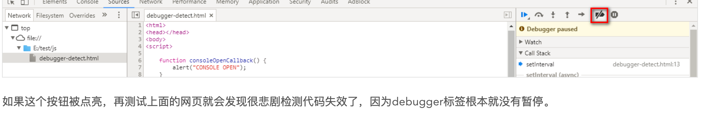

### 1.重写String
对于一些浏览器，如果控制台输出的是对象，则保留对象的引用，每次打开控制台的时候，如果对象类型是function、date等(以前还有regexp，现在已失效)，都会重新调用一下对象的toString()方法，将返回结果打印到控制台上。

经过测试：

1)、先声明对象，再重写toString，最后打印对象，那么toString会在开始时多运行一次，所以可以使用一个计数器来判断哪次有效

2)、先声明对象，再打印对象，最后重写toString，那么如果初始化时控制台是开启状态，会检测不到这一次的状态

3)、先声明对象，再重写toString，最后打印对象，但是对象不作为第一个参数，此时就可以成功监测每一次控制台状态了

4)、console.log、console.info、console.error等均有效

5)、只在chrome内核浏览器有效，firefox、ie失效

当第一次在此页面打开控制台时会触发到检测，但是如果是在一个已经打开了控制台的窗口中粘贴网址访问则不会触发，同理在此页面上已经打开控制台时刷新也不会触发。这种方式虽然比较取巧，但是并不具有通用性，并且<code style="color:red">只能捕获到开发者工具处于关闭状态向打开状态转移的过程</code>，具有一定的局限性。

```html
<html>
<head>
    <title>console detect test</title>
</head>
<body>
<script>
 
    /**
     * 控制台打开的时候回调方法
     */
    function consoleOpenCallback(){
        alert("CONSOLE OPEN");
        return "";
    }
 
    /**
     * 立即运行函数，用来检测控制台是否打开
     */
    !function () {
        // 创建一个对象
        let foo = {};
        // 将其打印到控制台上，实际上是一个指针
        console.log(foo);
        // 要在第一次打印完之后再重写toString方法
        foo.toString = consoleOpenCallback;
    }()
 
</script>
</body>
</html>
```

### 2.debugger
2.debugger类似于代码里的断点，浏览器在打开开发者工具时（对应于代码调试时的debug模式）检测到debugger标签（相当于是程序中的断点）的时候会暂停程序的执行：此时需要点一下那个蓝色的“Resume script execution”程序才会继续执行，这中间会有一定的时间差，通过判断这个时间差大于一定的值就认为是打开了开发者工具。这个方法并不会误伤，当没有打开开发者工具时遇到debugger标签不会暂停，所以这种方法还是蛮好的，而且通用性比较广。下面是一个使用debugger标签检测开发者工具是否打开的例子：
```html
<html>
  <head></head>
  <body>
    <script>
      function consoleOpenCallback() {
        alert('CONSOLE OPEN')
      }

      !(function () {
        const handler = setInterval(() => {
          const before = new Date()
          debugger
          const after = new Date()
          const cost = after.getTime() - before.getTime()
          if (cost > 100) {
            consoleOpenCallback()
            clearInterval(handler)
          }
        }, 1000)
      })()
    </script>
  </body>
</html>
```
但是上面的代码有一个很严重的bug，就是在执行到debugger那一行的时候如果用户发现了猫腻没有点按resume script execution按钮，而是直接退出页面的话，那么将不能检测到本次的打开开发者工具行为，实际结果与预期不符，我认为这是严重bug，就像电影里演的不小心踩到地雷及时察觉不抬脚就还有活命机会，到了debugger标签我察觉到这是检测控制台是否打开的代码我退出然后使用其它手段绕过它，那我可能做了一个假功能。

有一个需要注意的地方就是使用此方法的时候当卡在debugger标签的时候，用户是能够看到debugger标签附近的代码的，如果是有经验的用户一眼就能看出里面的道道，所以要想办法隐藏一下真实目的，比如将debugger标签隐藏，并且对代码进行混淆尽量增加阅读难度，关于如何隐藏debugger标签前后的逻辑，可以参考这几个网站：（当前2018-7-4 23:12:17有效）

http://app2.sfda.gov.cn/datasearchp/gzcxSearch.do?formRender=cx&optionType=V1

https://www.qimai.cn/

使用此种方案的话可能有个需要注意的点就是debugger是有可能不会暂停的，比如Chrome浏览器的source面板可以选择在debugger语句时不暂停：



其实debugger标签还有另一种妙用，比如用来反调试，可以设定一个每秒就触发一个debugger，让调试者疲于应付debugger或者耗费他额外的成本去覆盖掉JS，上面给出的几个网站就是这么做的。下面是一个使用debugger标签反js调试的简单例子：

```html
<html>
  <head>
    <title>Anti debug</title>
  </head>
  <body>
    <script>
      !(function () {
        setInterval(() => {
          debugger
        }, 1000)
      })()
    </script>
  </body>
</html>
```

一个实际的例子，这个网站：http://jxw.uou0.com/的js检测脚本，而针对不同的情况它又会有不同的反调试策略。注意要想复现需要粘贴视频地址解析之后才会加载检测脚本，比如可以尝试解析这个视频：http://film.qq.com/film/p/topic/thwjlxby/index.html。当未打开开发者工具进行解析，然后打开开发者工具，则会使用这种检测方式：

```js
!function() {
    var timelimit = 50;
    var open = false;
    setInterval(function() {
        var starttime = new Date();
        debugger ;if (new Date() - starttime > timelimit) {
            open = true;
            window.stop();
            $("#loading").hide();
            $("#a1").remove();
            $("#error").show();
            $("#error").html("\u7cfb\u7edf\u68c0\u6d4b\u975e\u6cd5\u8c03\u8bd5\u002c\u8bf7\u5237\u65b0\u91cd\u8bd5\u0021")
        } else {
            open = false
        }
    }, 500)
}();
```


而当已经打开开发者工具再粘贴地址进行视频解析的话，将会触发无限debugger。

当然，应付上面脚本最简单的方法是把Chrome浏览器设定为Deactive breakpoint，上面的脚本就歇菜了，不过这样的话自己也没办法调试了，用来反调试确实能够恶心一下对面的家伙，比较好的方法是使用Fiddler修改网页返回内容过滤掉debugger标签可以完美破解此套路。

### 3.比较当前窗口宽高与页面可见内容宽高
```js
窗口高度 screen.height 窗口宽度screen.width

window.innerWidth / window.innerHeight ：可视区域的宽高，window.innerWidth包含了纵向滚动条的宽度，window.innerHeight包含了水平（横向）滚动条的宽度。(可以理解为浏览器页面可用宽/高)

window.outerWidth / window.outerHeight：会在innerWidth和innerHeight的基础上加上工具条的宽度。(可以理解为浏览器窗口宽/高)

document.body.clientWidth/document.body.clientHeight 是除去滚动条宽/高后页面实际使用宽/高
```