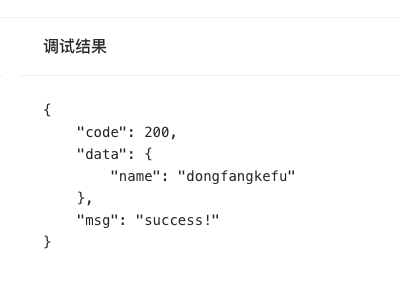

将对象数据 `{code:200,data: {name:'dongfangkefu'},msg:'success!'}` 在网页中json格式化展示

1. 使用json.stringify方法添加间隔符号
```
JSON.stringify("{code:200,data: {name:'dongfangkefu'},msg:'success!'}", null, 4)
```
2.添加css样式，即可在html中实现格式化展示
css：
```
.code-style {
  overflow-y: scroll;
  white-space: break-spaces;
  word-break: break-word;
}
```
html：
```
 <code className="code-style">{JSON.stringify(backData, null, 4)}</code>
 ```
网页显示：

