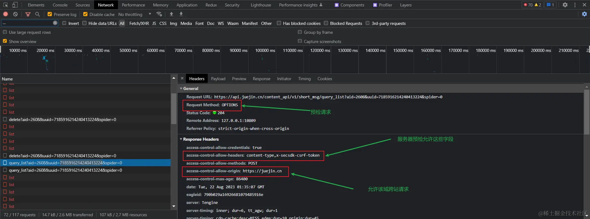
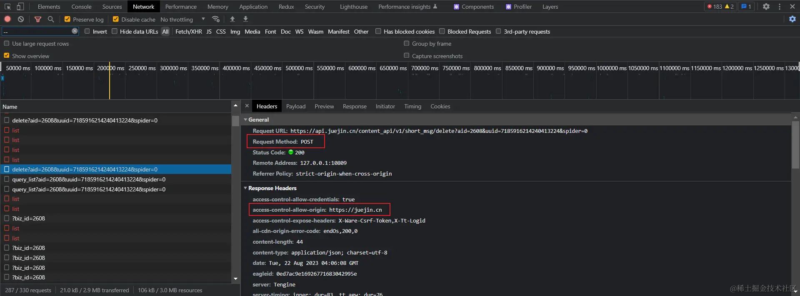

非简单请求的 CORS 请求，会在正式通信之前，增加一次 HTTP 查询请求，称为 预检请求。

需预检的请求要求必须首先使用 OPTIONS 方法发起一个预检请求到服务器，以获知服务器是否允许该实际请求。预检请求 的使用，可以避免跨域请求对服务器的用户数据产生未预期的影响。

它首先会发起一个预检请求,预检请求的头信息包括两个特殊字段：

* Access-Control-Request-Method：该字段是必须的，用来列出浏览器的 CORS 请求会用到哪些 HTTP 方法，上例是 POST。
* Access-Control-Request-Headers：该字段是一个逗号分隔的字符串，指定浏览器 CORS 请求会额外发送的头信息字段，上例是 content-type,x-secsdk-csrf-token。
* access-control-allow-origin：在上述例子中，表示 https://juejin.cn 可以请求数据，也可以设置为* 符号，表示统一任意跨源请求。
access-control-max-age：该字段可选，用来指定本次预检请求的有效期，单位为秒。上面结果中，有效期是 1 天（86408 秒），即允许缓存该条回应 1 天（86408 秒），在此期间，不用发出另一条预检请求。

一旦服务器通过了 预检请求，以后每次浏览器正常的 CORS 请求，就都跟简单请求一样，会有一个 Origin 头信息字段。服务器的回应，也都会有一个 Access-Control-Allow-Origin 头信息字段。

