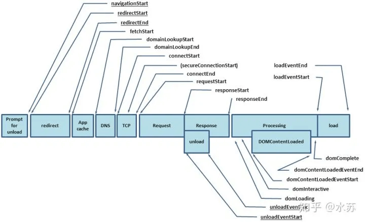
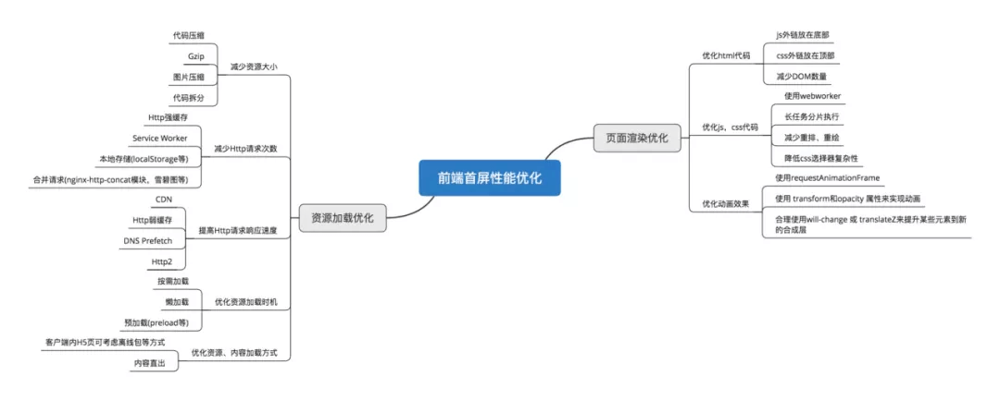

## 一、什么是首屏加载
首屏时间（First Contentful Paint），指的是浏览器从响应用户输入网址地址，到首屏内容渲染完成的时间，此时整个网页不一定要全部渲染完成，但需要展示当前视窗需要的内容，首屏加载可以说是用户体验中最重要的环节

### 关于计算首屏时间
利用performance.timing提供的数据：



通过DOMContentLoad或者performance来计算出首屏时间

```
// 方案一：

document.addEventListener('DOMContentLoaded', (event) => {
    console.log('first contentful painting');
});

// 方案二：

performance.getEntriesByName("first-contentful-paint")[0].startTime

// performance.getEntriesByName("first-contentful-paint")[0]

// 会返回一个 PerformancePaintTiming的实例，结构如下：

{
  name: "first-contentful-paint",
  entryType: "paint",
  startTime: 507.80000002123415,
  duration: 0,
};

```

## 二、加载慢的原因
在页面渲染的过程，导致加载速度慢的因素可能如下：

- 网络延时问题
- 资源文件体积是否过大
- 资源是否重复发送请求去加载了
- 加载脚本的时候，渲染内容堵塞了
- 
## 三、解决方案
常见的几种SPA首屏优化方式

- 减小入口文件积
- 静态资源本地缓存
- UI框架按需加载
- 图片资源的压缩
- 组件重复打包
- 开启GZip压缩
- 使用SSR
  
