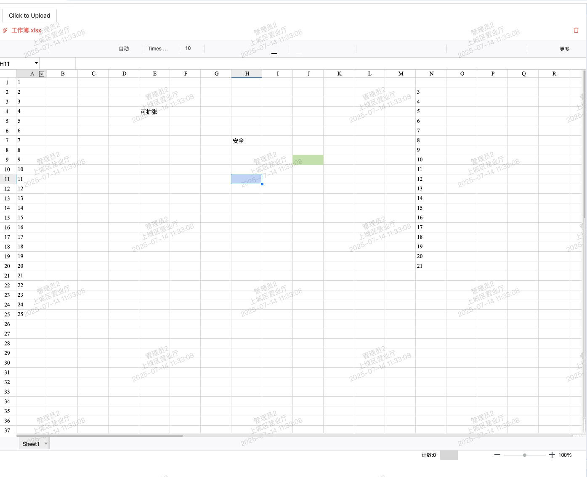

在调研在线表格编辑的需求中测试了 luckyexcel + luckysheet 组合，优点是免费开源，支持本地文件导入在线编辑 ，缺点是已停止维护，插件中一些 API 已过时，如果预算够可以直接上 univer sheets

下面介绍一下 luckyexcel + luckysheet 使用流程

#### 1.安装俩款插件到项目

```
npm i luckyexcel 


npm i luckysheet
```

#### 2.使用luckyexcel预览本地文件
```vue
<script setup lang="ts">
import LuckyExcel from 'luckyexcel'

const fileList = ref<any[]>([])

// 上传拦截
const beforeUpload = (file: any) => {
  const reader = new FileReader()

  fileList.value = [...(fileList.value || []), file]

  LuckyExcel.transformExcelToLucky(file, function (exportJson: any) {
    if (!exportJson) {
      console.error('文件导入失败')
      return
    }
  })
}
onBeforeMount(() => {})
</script>
```

#### 引入  luckysheet

```vue
LuckyExcel.transformExcelToLucky(file, function (exportJson: any) {
    if (!exportJson) {
      console.error('文件导入失败')
      return
    }

    // 初始化Luckysheet
    Luckysheet.create({
      container: 'sheet-container', // 容器ID
      lang: 'zh',
      gridKey: 'sheet-container-grid',
      title: exportJson.info.name,
      data: exportJson.sheets,
    })
})
```

完整代码

```
<template>
  <div class="sheet">
    <div class="sheet-upload">
      <a-upload
        v-model:file-list="fileList"
        action="#"
        accept=".xlsx"
        :before-upload="beforeUpload"
        @remove="handleRemove"
      >
        <a-button>
          <upload-outlined></upload-outlined>
          Click to Upload
        </a-button>
      </a-upload>
    </div>
    <div id="sheet-container" style="width: 100%; height: 1000px"></div>
  </div>
</template>
<script setup lang="ts">
import LuckyExcel from 'luckyexcel'
import Luckysheet from 'luckysheet'
import 'luckysheet/dist/css/luckysheet.css'
import 'luckysheet/dist/plugins/css/pluginsCss.css'
import 'luckysheet/dist/plugins/plugins.css'
import 'luckysheet/dist/plugins/js/plugin.js'
import type { UploadProps } from 'ant-design-vue'

const fileList = ref<any[]>([])

const handleRemove: UploadProps['onRemove'] = (file: any) => {
  const index = fileList.value.indexOf(file)
  const newFileList = fileList.value.slice()
  newFileList.splice(index, 1)
  fileList.value = newFileList
}

const beforeUpload = (file: any) => {
  console.log('上传文件', file)
  const reader = new FileReader()

  if (!file) return
  fileList.value = [...(fileList.value || []), file]

  // 转换Excel文件为Luckysheet可用的数据
  LuckyExcel.transformExcelToLucky(file, function (exportJson: any) {
    if (!exportJson) {
      console.error('文件导入失败')
      return
    }

    // console.log('Luckysheet', Luckysheet)
    console.log('exportJson', exportJson)

    // 初始化Luckysheet
    Luckysheet.create({
      container: 'sheet-container', // 容器ID
      lang: 'zh',
      gridKey: 'sheet-container-grid',
      title: exportJson.info.name,
      data: exportJson.sheets,
    })
  })
}
onBeforeMount(() => {})
</script>
<style lang="less">
.sheet {
  &-upload {
    padding: 12px;
  }
}
</style>
<style></style>
```

引入后会发现控制台提示 `$ is not defined` , `mousewheel is not a function`， 这是因为 luckysheet 是 jquery 开发，需要声明使用 $, 其次 使用的 mousewheel 已弃用，需要重写

安装 jquery

```
npm i jquery
```

函数重写，声明 mousewheel 
```vue
// app.vue
onBeforeMount(() => {
  if (!window?.$ || !window.jQuery) {
    console.log('没有设置jquery')
    window['jQuery'] = window.$ = jQuery

    // 重写 jquery 中的 mousewheel
    if (typeof $.fn.mousewheel === 'function') return

    $.fn.mousewheel = function (callback) {
      return this.on('wheel', function (e) {
        const event = $.event('mousewheel', {
          deltaY: -e.originalEvent.deltaY,
          originalEvent: e,
        })
        callback.call(this, event)
      })
    }
  }
})
```
最终效果

