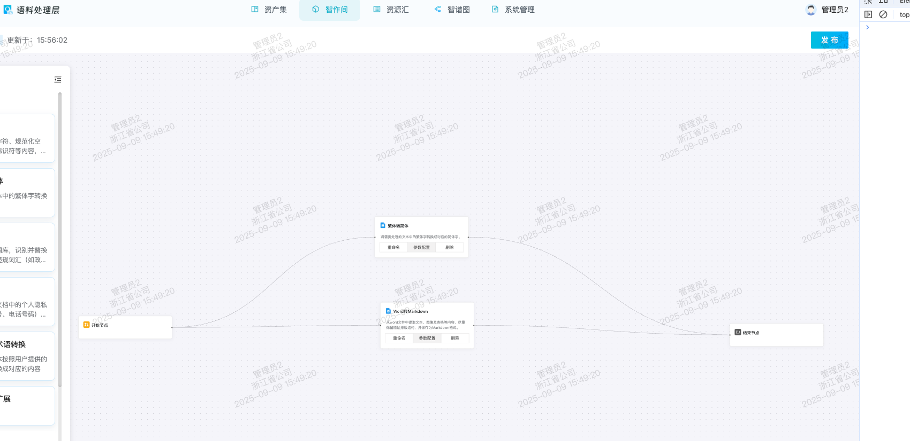
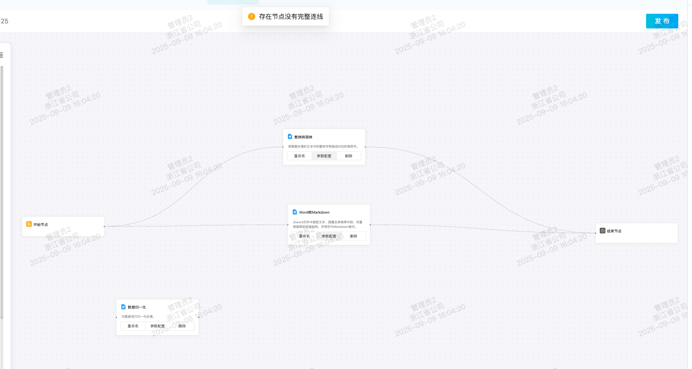
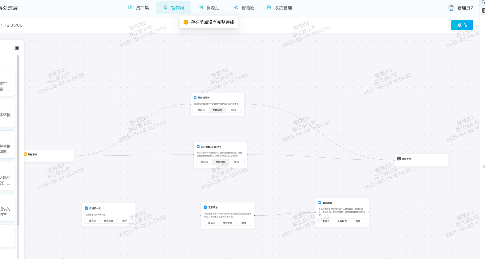
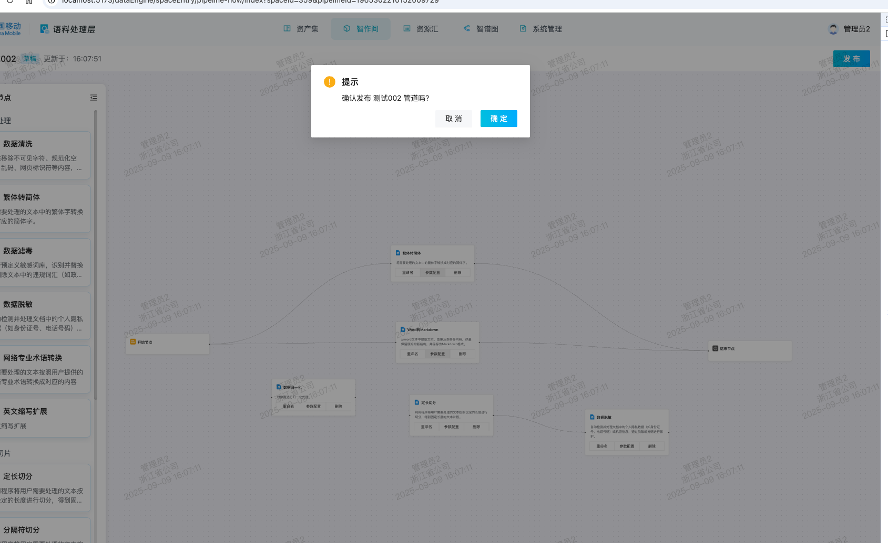
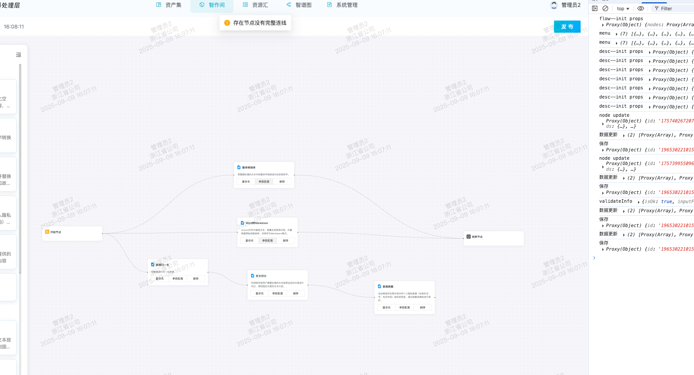

在自定义画布中，需要进行连线校验，从开始节点出发的流程都必须到达结束节点



### 法1
```js
// 校验画布数据
function validateFlow() {
  let result = true
  let inputFileType = ''
  try {
    nodes.value.forEach((it) => {
      if (it.id === enumNodes.start) {
        if (!edges.value.some((edge) => it.source == edge.id)) {
          throw '开始节点没有连线'
        }
        // 开始节点
      } else if (it.id === enumNodes.end) {
        if (!edges.value.some((edge) => it.source == edge.id)) {
          throw '结束节点没有连线'
        }
        // 结束节点
      } else if (it.id !== enumNodes.result) {
        if (!edges.value.some((edge) => it.target == edge.id) || !edges.value.some((edge) => it.source == edge.id)) {
        }
      }
    })

    const firstNodeId = edges.value.find((edge) => edge.source == enumNodes.start)?.target
    if (firstNodeId) {
      inputFileType = (nodes.value.find((node) => node.id == firstNodeId) as nodeProps)?.data?.inputFormat || ''
    }
  } catch (e: unknown) {
    createMessage.warning('存在节点没有完整连线')
    result = false
  } finally {
    return {
      isOk: result,
      inputFileType,
    }
  }
}
```
以上方法针对图上数据能够达到校验效果，但是如果有闲置节点就会失败，如(图2)：




进行改进就有法2
### 法2
```js
function validateFlow() {
  let result = true
  let inputFileType = ''
  try {
    let nodeObjCount: any = {}
    edges.value.forEach((edge) => {
      if (!nodeObjCount[edge.source]) {
        nodeObjCount[edge.source] = 1
      } else {
        nodeObjCount[edge.source] += 1
      }
      if (!nodeObjCount[edge.target]) {
        nodeObjCount[edge.target] = 1
      } else {
        nodeObjCount[edge.target] += 1
      }
    })
    if (!nodeObjCount[enumNodes.start]) {
      throw '开始节点没有连线'
    } else if (!nodeObjCount[enumNodes.end]) {
      throw '结束节点没有连线'
    } else {
      for (const i in nodeObjCount) {
        // 节点的连线除开开始节点、结束节点都需要是2的倍数
        if (enumNodes.start !== i && enumNodes.end !== i && nodeObjCount[i] % 2) {
          throw '存在节点没有完整连线'
        }
      }
    }
    const firstNodeId = edges.value.find((edge) => edge.source == enumNodes.start)?.target
    if (firstNodeId) {
      inputFileType = (nodes.value.find((node) => node.id == firstNodeId) as nodeProps)?.data?.inputFormat || ''
    }
  } catch (e: unknown) {
    createMessage.warning('存在节点没有完整连线')
    result = false
  } finally {
    return {
      isOk: result,
      inputFileType,
    }
  }
}
```
上述方法可以处理图2中的情况，但是出现节点之间连线在开始-结束链路之外，不会参与主任务的就会校验失败，如(图3)：



所以校验应该从开始节点到结束节点，一个个开始，每一条分支都需要校验

### 衍生出法3:
```js
// 校验画布数据
function validateFlow() {
  let result = true
  let inputFileType = ''
  try {
    result = findNextNode(enumNodes.start, edges.value)
    if (!result) {
      throw '存在节点没有完整连线'
    }

    const firstNodeId = edges.value.find((edge) => edge.source == enumNodes.start)?.target
    if (firstNodeId) {
      inputFileType = (nodes.value.find((node) => node.id == firstNodeId) as nodeProps)?.data?.inputFormat || ''
    }
  } catch (e: unknown) {
    createMessage.warning('存在节点没有完整连线')
    result = false
  } finally {
    return {
      isOk: result,
      inputFileType,
    }
  }
}

function findNextNode(id: string, dataSource: any[]) {
  // 可能有多条线
  const nextIds: any = []
  dataSource.forEach((it) => {
    if (it.source == id) {
      // 后续可以在这里进行节点配置判断后再进行下一步
      nextIds.push(it.target)
    }
  })
  // 开始节点发出的连线都必须达到结束节点
  return (
    nextIds?.length &&
    nextIds.every((next: string) => {
      if (next == enumNodes.end) {
        return true
      } else {
        return findNextNode(
          next,
          dataSource.filter((item) => item.id != `${id}-${next}`), // 实测之后发现 换到  dataSource.filter((item) => item.source != id && item.target !== next) 更好
        )
      }
    })
  )
}
```





根据上图显示能够达到预期

但是会发现 dataSource 的循环优化不是很好，通过达模型对 findNextNode 进行优化：
```js
// 查找当前连线是否正常
function findNextNode(id: string, dataSource: any[], visited: Set<string> = new Set()): boolean {
  // 检测环路：出现回访则视为无效
  if (visited.has(id)) {
    return false
  }
  visited.add(id)

  // 找到当前节点的所有出边
  const nextIds: string[] = dataSource.filter((edge) => edge.source == id).map((edge) => edge.target)

  // 没有出边时，只有到达结束节点才算有效
  if (!nextIds.length) {
    return id == enumNodes.end
  }

  // 所有分支都必须能最终到达结束节点
  return nextIds.every((next) => {
    if (next == enumNodes.end) {
      return true
    }
    return findNextNode(next, dataSource, new Set(visited))
  })
}
```