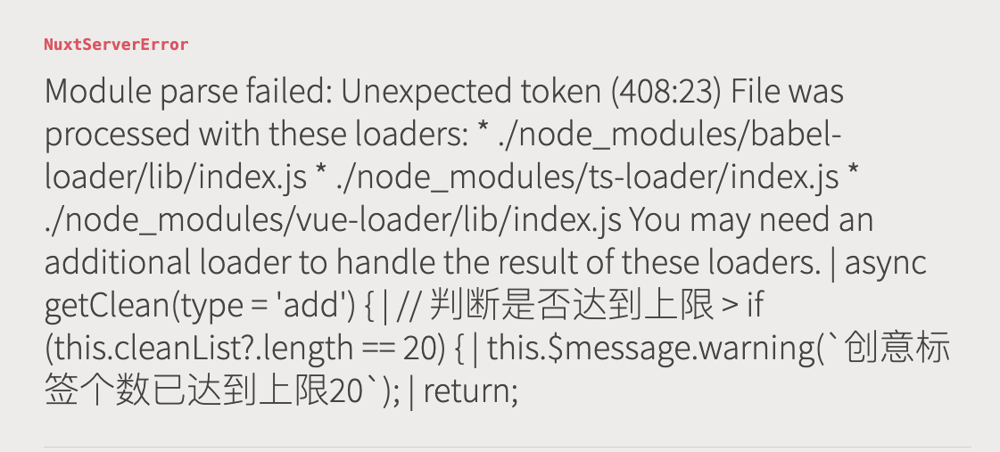

运行项目，提示不支持 可选链操作符(?.) , 建议 You may need an additional loader to handle the result of these loaders （您可能需要额外的加载器来处理这些加载器的结果）



处理：

1. 安装依赖（Babel）

为了避免出现兼容问题，装好对应的转换器
```
npm install @babel/plugin-proposal-optional-chaining
```
2.添加至项目.babel.config.js文件中：

{
  "plugins": [
    "@babel/plugin-proposal-optional-chaining",
 ]
}
// nuxt 可以更改 nuxt.config.ts
build: {
    babel: {
        plugins: ['@babel/plugin-proposal-optional-chaining']
    }
}
友情提示：<template>中暂时还不支持可选链语法

nuxt项目也可以直接在 nuxt.config.ts 项目中添加更改
……
build: {
    // 兼容可选链操作符
    babel: {
        plugins: [
            "@babel/plugin-proposal-optional-chaining"
        ]
    }
}


3.实际中的示例

全局函数

export default function useOptionChain(target) {

    return new Proxy(target, {
        get:  (target, propKey)=> {
            const proKeyArr = propKey.split('?.')
            return  proKeyArr.reduce((a,b)=>a?.[b],target)
        }
    })
}
使用

<template>
  <div id="app">
 //保留可选链的写法，更直观的展示，想要拿数组的元素直接取下标的数字即可，不需要 []
    <h1 v-if="useOptionChain(arr)['0?.obj?.a?.b']">数组对象</h1>
    <h1 v-if="useOptionChain(obj)['arr?.0?.a']">对象数组</h1>
  </div>
</template>

<script>
//引入函数
import useOptionChain from "@/utils";

export default {
  name: "App",
  components: {},
  data() {
    return {
      arr: [
        {
          obj: {
            a: {
              b: "数组对象",
            },
          },
        },
      ],
      obj: {
        arr: [
          {
            a: "对象数组",
          },
        ],
      },
    };
  },
  methods: {
    useOptionChain,
  },
};
</script>
参考链接：https://www.jianshu.com/p/8e8668822a3a