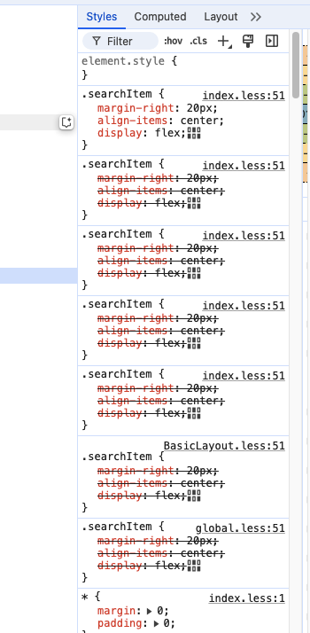

```js
import styles from './index.less';

// 使用
<div className={styles.demo}></div>
```
使用上种方法是将整个styles以对象导入，在页面中访问使用，也可以添加cssLoader，实现类名直接使用

允许指定一个函数来生成className。默认情况下，我们使用内置函数来生成className。如果自定义函数返回null或未定义，我们会退回到内置功能以生成className，https://github.com/webpack-contrib/css-loader#modules
```js
// 配置文件
  cssLoader: {
    modules: {
      getLocalIdent: (context, localIdentName, localName) => {
        if (
          context.resourcePath.includes('node_modules') ||
          context.resourcePath.includes('global.less')
        ) {
          return localName;
        }
        const match = context.resourcePath.match(/src(.*)/);
        if (match && match[1]) {
          return `${localName}`.replace(/--/g, '-');
        }
        return localName;
      },
    },
  },

// 使用
<div className={styles.demo}></div>
<div className=“demo”></div>
```

或者直接导入less文件，用类名直接使用
```js
import './index.less';

// 使用
<div className="less"></div>
```

### 坏处
会导致类名重复注入

