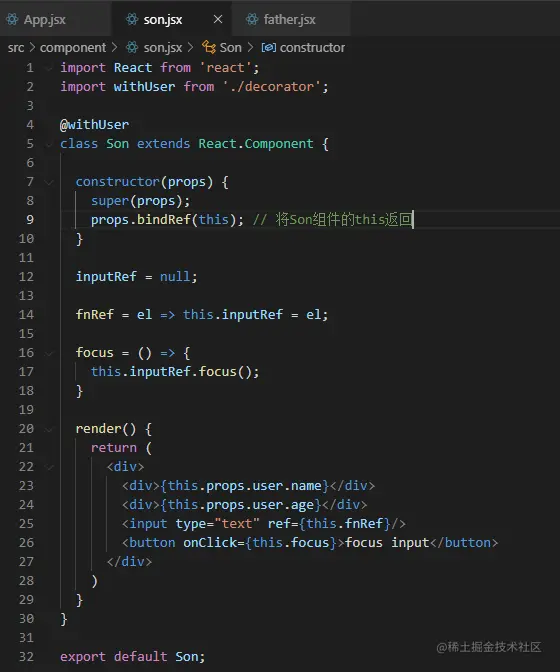
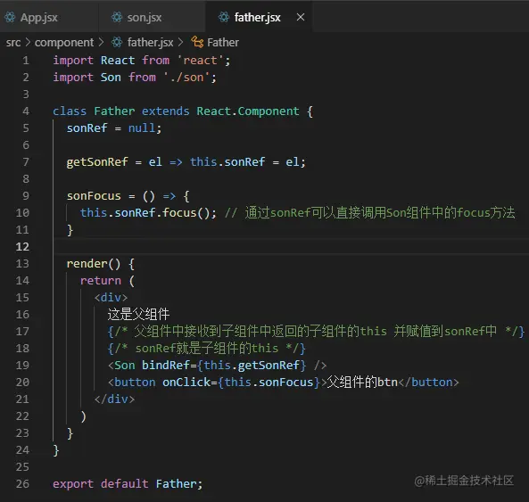

### 一、string类型直接绑定
```html
<label ref='service' htmlFor='jsPang'>增加服务</label>
```
- 获取dom节点方式：
```js
console.log(this.refs.service)
```
### 二、react.CreateRef()、react.useRef()
- 通过在class中使用React.createRef()方法创建一些变量
```js
refName = React.createRef
// 将这些变量绑定到标签的ref中
<input ref={this.refName }></input>
```
### 三、函数形式
1.函数直接写
```js
// 参数为回调值，是dom元素
<input ref={(el) =>{this.input = el}}> </input>
```
2.在class中声明函数，在函数中绑定ref。使用这种方法可以将子组件暴露给父组件以使得父组件能够调用子组件的方法

