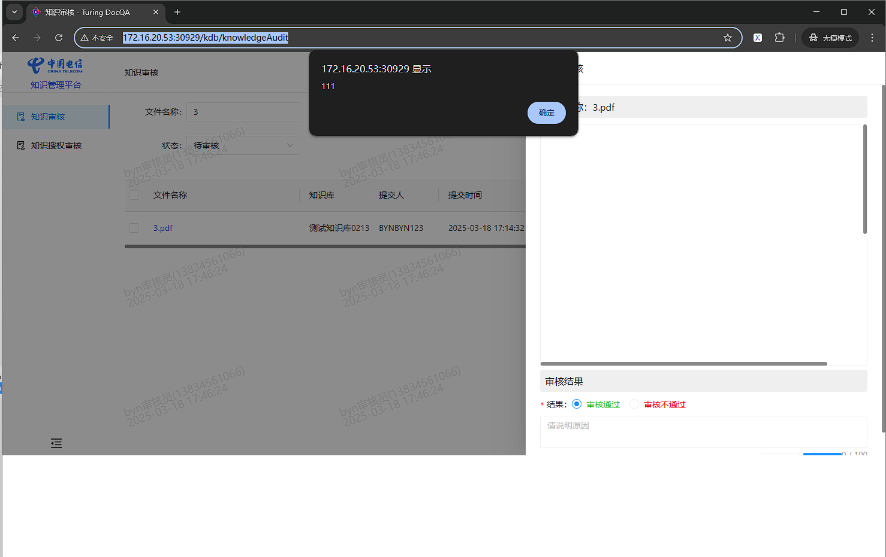

预览pdf文件出现alert弹窗



出现特殊弹窗，起始以为是js程序执行，后面调研几轮发现是pdf文档中用了特殊字体


这个字体网页中是没有的，加载不到相应的字体资源也就出现了提示弹窗，点完弹窗(多个特殊字体会出现多次，如上图是12次)后续预览时是空白的

解决方法：

在组件内重写alert

```jsx
/* eslint-disable import/no-unresolved */
import { message } from 'antd';
import { useEffect, useState } from 'react';
import { Document, Page, pdfjs } from 'react-pdf';
import 'react-pdf/dist/Page/AnnotationLayer.css';
import 'react-pdf/dist/Page/TextLayer.css';

// eslint-disable-next-line compat/compat
pdfjs.GlobalWorkerOptions.workerSrc = new URL(
  'pdfjs-dist/build/pdf.worker.min.js',
  import.meta.url
).toString();


const PdfViewer = (props) => {
  const { url } = props;
  const [numPages, setNumPages] = useState(0);

  useEffect(() => {
    // 保存原生 alert 函数
    const originalAlert = window.alert;

    let isTip = false;
    // 重写 alert 方法
    window.alert = (e) => {
      // 执行自定义逻辑（如触发 React 状态更新）
      console.log('Alert triggered with message:', e);

      if (e == '111') {
        if (!isTip) {
          message.warning('疑似使用特殊字符，影响文件预览效果');
          isTip = true;
        }
      } else {
        // 调用原始 alert
        originalAlert(e);
      }

      // 可在此触发其他回调（如关闭弹窗后的操作）
      // handleAlertClose();
    };

    // 组件卸载时恢复原生 alert
    return () => {
      window.alert = originalAlert;
    };
  }, []);

  const onDocumentLoadSuccess = ({ numPages }) => {
    setNumPages(numPages);
  };

  const handleError = (error) => {
    console.error('加载错误', error);
    return false;
  };

  return (
    <Document
      file={url}
      options={{
        disableFontFace: true,
        useSystemFonts: false,
      }}
      onLoadSuccess={onDocumentLoadSuccess}
      onLoadError={handleError}
    >
      {/* eslint-disable-next-line compat/compat */}
      {Array(numPages)
        .fill('pdf')
        ?.map((_, i) => (
          <Page pageNumber={i + 1} key={`page${i + 1}`} onLoadError={handleError} />
        ))}
    </Document>
  );
};
export default PdfViewer;
```
