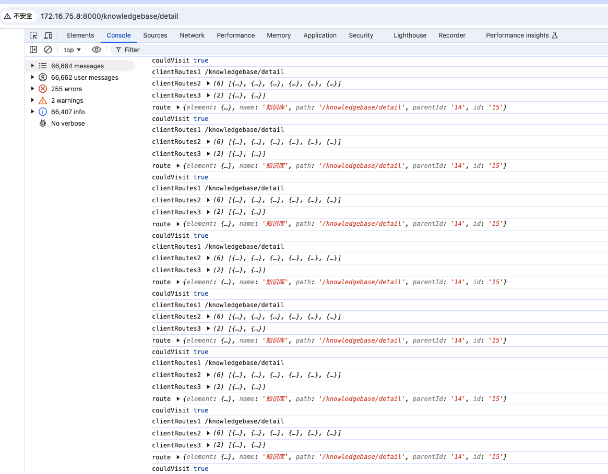

在umi中设置父级路由跳转到子级可以使子级与其path属性值一致，或者设置为 `''`，但不能使用 redirect 属性定位
到某一子级会引发重复定位

```js
export const routes = [
  {
    path: '/',
    component: '@/layouts/BasicLayout', // 默认菜单布局
    routes: [
      {
        name: '跳转首页',
        path: '/', // 也可以写成 path:''
        redirect: '/home',
        hideMenu: true,
      },
      {
        name: '首页概览',
        path: '/home',
        icon: '/svg/home.svg',
        acIcon: '/svg/home_ac.svg',
        component: './Home', // 默认指向src/pages目录
      },
    ]
  }
]
```
如果是这是redirect属性到其某一子级会导致页面内存超栈
```js
  {
    path: '/knowledgebase',
    redirect: '/knowledgebase/detail',
    hideMenu: true,
    routes: [
      {
        name: '知识库',
        path: '/knowledgebase/detail',
        component: './KnowledgeBase',
      },
    ],
  },
```
当访问 `/knowledge` 或 `/knowledgebase/detail` 路径时：


