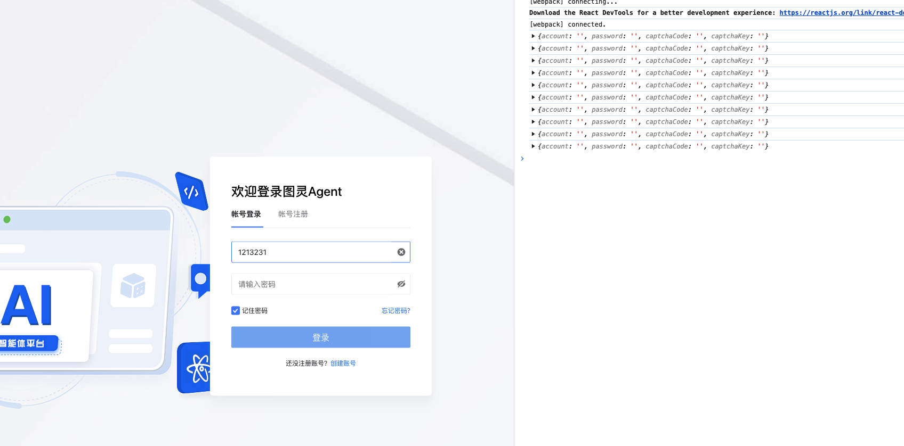
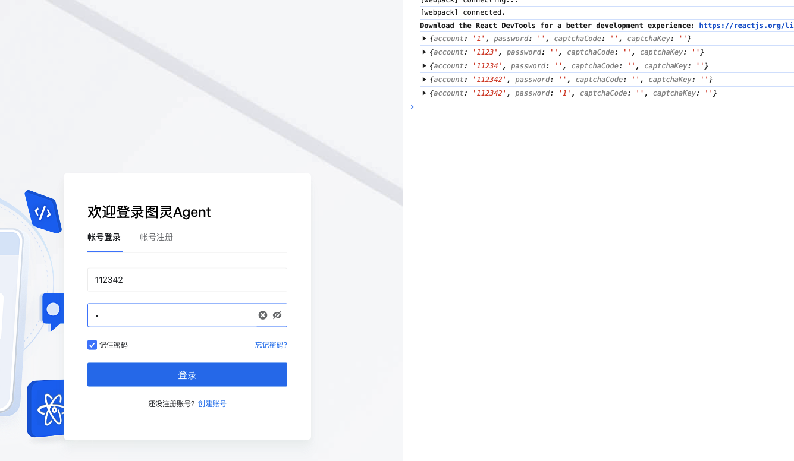

为项目登录添加快捷键，在按起enter健后打印表单数据，但是在函数组件是闭包状态，当在副作用初始化添加，无论按下
多少次都获取不到事件
```js
useEffect(() => {
    const keyEvent = (data) => {
        if (
        (data.key == 'Enter' || data.code == 'Enter') &&
        props.tabKey == 'login'
        ) {
         console.log(loginForm)
         // handleLogin();
        }
    };
    document.addEventListener('keyup', keyEvent, true);
    return () => {
        document.removeEventListener('keyup', keyEvent, true);
    };
}, []);
```

虽然可以成功绑定上，但因为函数组件的数据更新每次会形成一个闭包，所以会导致获取不到最新的loginForm数据
解决：将 keyup 事件与 loginForm 关联
```js
  useEffect(() => {
    const keyEvent = (data) => {
      if (
        (data.key == 'Enter' || data.code == 'Enter') &&
        props.tabKey == 'login'
      ) {
        console.log(loginForm)
        // handleLogin();
      }
    };
    document.addEventListener('keyup', keyEvent, true);
    return () => {
      document.removeEventListener('keyup', keyEvent, true);
    };
  }, [loginForm]);
```
