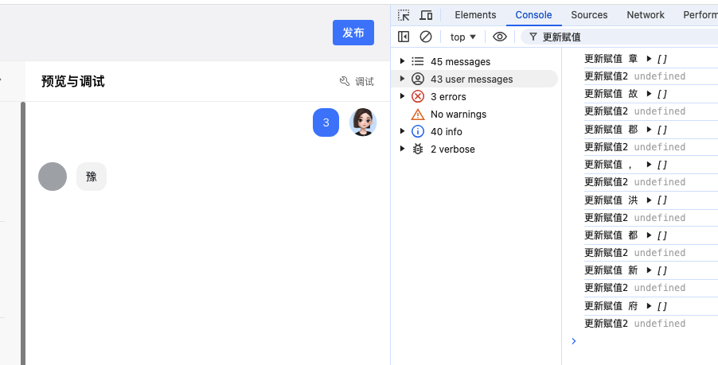
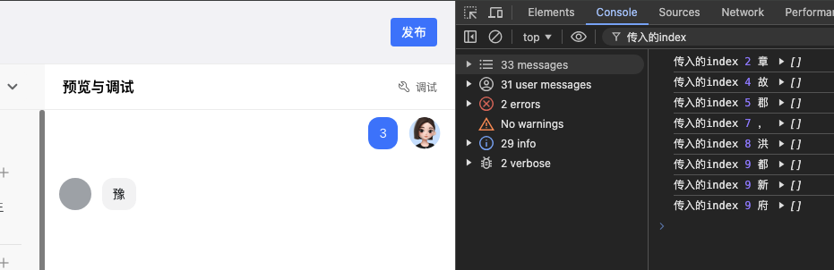

在连续使用useState勾子函数更新同一变量值，很容易出现数据混乱，特别是在对话场景中:



代码如下

```js

  const [messgae,setMessage] = useState([])

  const textRequest = () => {
    let str = '豫章故郡，洪都新府。';
    let curDataId = '';
    let index = 0;
    const tempData = {
      content: str[index],
      botChatId: '123',
      type: 'text',
    };
    const interval = setInterval(() => {
      if (index > str.length - 1) {
        clearInterval(interval);
        return;
      }
      let curText = str[index]; // 因为index是递增的，在延时函数中如果传入str[index]值会是当时index访问str的结果，不准确,所以不使用变量代指，直接用string
      if (!curDataId) {
        console.log('赋值基础信息');
        curDataId = tempData.botChatId;
        setMessage((prevMessage) => {
          const updatedMessages = [...prevMessage];
          updatedMessages[updatedMessages.length - 1] = {
            ...updatedMessages,
            ...tempData,
            status: 'incomplete',
          };
          return updatedMessages;
        });
      } else {
        let curIndex = JSON.parse(JSON.stringify(index));
        setTimeout(() => {
          updateChatContent(
            curText || '',
            tempData.botChatId ? 'incomplete' : 'complete',
            curIndex, // 同上延迟函数中使用不使用变量
          );
        }, 50 * index);
      }
      ++index;
    }, 100);
  };

  const updateChatContent = (
    newContent: any,
    status = 'complete',
    index: number,
  ) => {
    setTimeout(() => {
      console.log('传入的index'，index)
      setMessage((prevMessage) => {
        const updatedMessages = [...prevMessage];
        updatedMessages[updatedMessages.length - 1].content += newContent;
        updatedMessages[updatedMessages.length - 1].status = status;
        return updatedMessages;
      });
    }, index * 100);
  };

  textRequest()
```

在上面使用延迟函数中使用 JSON.parse(index)，不使用变量，避免因为访问属性时其值已更新



解决

1.当使用回调或者其他useState时，通过useEffect根据其变化更新页面样式

```js
  const [messgae,setMessage] = useState([])
  const [curResponse, setCurResponse] = useState('');
  const textRequest = () => {
    let str = '豫章故郡，洪都新府。';
    let curDataId = '';
    let index = 0;
    const tempData = {
      content: str[index],
      botChatId: '123',
      type: 'text',
    };
    const interval = setInterval(() => {
      console.log('index', index);
      if (index >= str.length - 1) {
        console.log('清除', interval);
        clearInterval(interval);
        return;
      }

      let curText = str[index];

      if (!curDataId) {
        console.log('赋值基础信息');
        curDataId = tempData.botChatId;
        setCurResponse((preValue) => str[index]);
      } else {
        setCurResponse((preValue) => curText);
      }
      ++index;
    }, 100);
  };

  useEffect(() => {
    console.log('curResponse 变化', curResponse);
    setMessage((prevMessage) => {
      const updatedMessages = [...prevMessage];
      updatedMessages[updatedMessages.length - 1] = {
        ...updatedMessages,
        content:
          updatedMessages[updatedMessages.length - 1].content + curResponse,
        status: 'incomplete',
      };
      return updatedMessages;
    });
  }, [curResponse]);

  textRequest()
```

1. 在使用useState更新页面样式时避免使用多个回调函数并在其中使用useState
```js
  const [curResponse, setCurResponse] = useState('');
  const textRequest = () => {
    let str = '豫章故郡，洪都新府。';
    let curDataId = '';
    let index = 0;
    const tempData = {
      content: str[index],
      botChatId: '123',
      type: 'text',
    };
    const interval = setInterval(() => {
      if (index > str.length - 1) {
        clearInterval(interval);
        return;
      }
      let curText = str[index];
      if (!curDataId) {
        curDataId = tempData.botChatId;
        setMessage((prevMessage) => {
          const updatedMessages = [...prevMessage];
          updatedMessages[updatedMessages.length - 1] = {
            ...updatedMessages,
            ...tempData,
            status: 'incomplete',
          };
          return updatedMessages;
        });
      } else {
        let curIndex = JSON.parse(JSON.stringify(index));
        setTimeout(() => {
          setMessage((prevMessage) => {
            const updatedMessages = [...prevMessage];
            updatedMessages[updatedMessages.length - 1] = {
              ...updatedMessages,
              content: (updatedMessages[updatedMessages.length - 1].content +=
                curText),
              status: 'incomplete',
            };
            return updatedMessages;
          });
        }, 50 * index);
      }
      ++index;
    }, 100);
  };
  textRequest()
```

