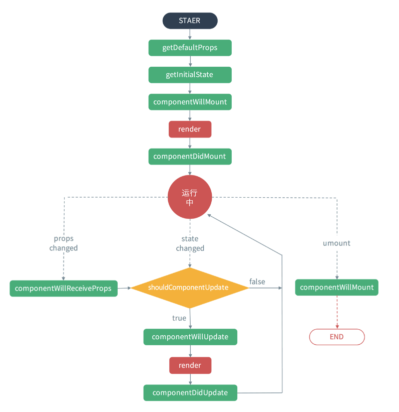

### class 写法

#### 生命周期顺序

挂载
* constructor
* componentWillMount
* componentDidMount
* render

更新
* componentWillReceiveProps
* shouldComponentUpdate
* componentWillUpdate
* componentDidUpdate
* render

捕获错误
* componentDidCatch(error, info)
  
卸载
* componentWillUnmount

声明周期：



```js
    import React, { PureComponent, Fragment } from "react";

    export default class demoInfo extend PureComponent {
        constructor (props) {
            super(props)

            this.state = {
                count: 1,
                name: 'xiaohuang'
            }
        }

        // 组件初始化
        componentDidMount() {
            console.log("page init___")
        }

        // 变量改变触发 preProps 包含 props里的变量， preState则包含this.state变量变化，在这里做监听处理
        componentDidUpdate(preProps,preState) {
            
        }

        const callBack = () => {
            console.log('执行回调')
        }

        // 渲染函数
        render() {
            const {name,count} = this.state
            <>
                <div>
                    <div>{name}: {count}</div>
                    <button onClick=(e=>{
                        this.setState({
                            count: count + 1
                        },() => {
                            // setState是异步处理，可以接受一个回调函数
                            this.callBack()
                        })
                    })>添加</button>
                </div>
            </>
        }

        // 组件销毁
        componentWillUnmount() {

        }
    }
```
简写省去 constructor
```jsclass Ellipsis extends Component {
  state = {
    text: '',
    targetCount: 0,
  };

   componentDidMount() {
        this.setState(
            {
                targetCount: 2
            },
        ); 
    }
}
```

PureComponent 会比 Component 更简洁。当使用component时，父组件的state或prop更新时，无论子组件的state、prop是否更新，都会触发子组件的更新，这会形成很多没必要的render，浪费很多性能；pureComponent的优点在于：pureComponent在shouldComponentUpdate只进行浅层的比较，只要外层对象没变化，就不会触发render,以期达到节省不必要渲染的目的。

注意当用类写法编写组件时：

1）如果组件使用条件判断渲染，可以在 componentDidMount或者constructor内实现父传子

2）若使用css控制展示，则需要在componentDidUpdate里实现父传子