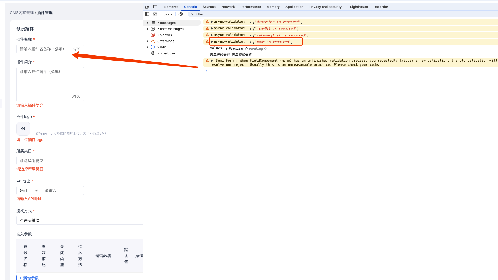

在使用 semi-ui 下 withField 方法编写一个自定义的 Form 验证表单时，提示 `When FieldComponent (name1) has an unfinished validation process, you repeatedly trigger a new validation, the old validation will be abandoned, and will neither resolve nor reject. Usually this is an unreasonable practice. Please check your code.` 大概就是由于重复渲染导致Form中某字段的验证过程被终止，没有执行完毕

业务代码如下：

```jsx
  const [errorInfo, setErrorInfo] = useState({
    url: '',
    outputParamDemo: '',
  });
  const [formData, setFormData] = useState<any>({});
  const MyName = (props: any) => {
    const { onChange, value } = props;
    return (
      <>
        <CountInput
          value={value}
          className="plugin-detail-input"
          placeholder="请输入插件名名称（必填）"
          maxLength={20}
          showCount
          onChange={onChange}
        ></CountInput>
      </>
    );
  };
  
  // 自定义的表单组件
  const NameField = withField(MyName, {
    valueKey: 'value', // 组件表示值的属性
    onKeyChangeFnName: 'onChange',
  });

  // 表单验证函数
  const validateForm = async (params: any) => {
    try {
      const values = formApiRef.current.validate();

      console.log('values', values);

      // url 与 outputParamDemo 未填写拦截
      if (Object.values(params).some((item) => item)) {
        throw '表单校验失败';
      }

      setLoading(true);
      ……
    } catch (error) {
      setLoading(false);
      console.log('表单校验失败', error);
    }
  };

  const handleOk = async () => {
    const tempError: any = {};
    if (!formData.url) {
      tempError.url = '请输入API地址';
    } else if (!handleRegular(formData.url, 'urlReg')) {
      tempError.url = '请API地址格式错误';
    } else {
      tempError.url = '';
    }
    if (!formData.outputParamDemo) {
      tempError.outputParamDemo = '请填写输出示例';
    } else {
      tempError.outputParamDemo = '';
    }
    setErrorInfo((pre) => {
      return {
        ...pre,
        ...tempError,
      };
    });
    validateForm(tempError);
  };

  return (
    <>
        <Form
            ref={formRef}
            getFormApi={getFormApi}
            className="common-form"
            initValues={{}}
        >
            <NameField
              label={{
                text: '插件名称',
              }}
              field="name"
              rules={[{ required: true, message: '请输入模型名称' }]}
            />
            <Form.TextArea
              className="plugin-detail-input"
              field="describes"
              label="插件简介"
              placeholder="请输入插件简介（必填）"
              maxLength={100}
              maxCount={100}
              rules={[{ required: true, message: '请输入插件简介' }]}
              disabled={isReadOnly}
            />
            {/* url，outputParamDemo 字段 */}
            <Form.Slot error={errorInfo.url}>
             ……
            </Form.Slot>
            <Form.Slot error={errorInfo.outputParamDemo}>
             ……
            </Form.Slot>
       </Form>
    </>
  )
```
页面及输出如下：

控制台输出了 name 未填写的提示，但是页面中插件名称下没有出现如插件简介的红色提示


### 分析

控制执行并比对代码后发现，在 handleOk 函数中 setErrorInfo 后就是 validateForm 表单验证。在执行层 setErrorInfo 的调用会触发组件重新渲染，同时调用 validateForm ，这会导致表单验证过程被中断，因为组件正在重新渲染，会导致 NameField 内容重新渲染，终止正在进行的表name字段的表单验证。


### 解决

1. 在 handleOK 方法中 ，validateForm 验证延后执行

```jsx
  const handleOk = async () => {
    const tempError: any = {};
    if (!formData.url) {
      tempError.url = '请输入API地址';
    } else if (!handleRegular(formData.url, 'urlReg')) {
      tempError.url = '请API地址格式错误';
    } else {
      tempError.url = '';
    }
    if (!formData.outputParamDemo) {
      tempError.outputParamDemo = '请填写输出示例';
    } else {
      tempError.outputParamDemo = '';
    }
    setErrorInfo((pre) => {
      return {
        ...pre,
        ...tempError,
      };
    });
    setTimeOut(() => {
        validateForm(tempError);
    },0)
  };
```   
2. 与 outputParamDemo 一样，自定义 name 字段的校验与展示

```jsx
  const [errorInfo, setErrorInfo] = useState({
    name: '',
    url: '',
    outputParamDemo: ""
  });
  const MyName = (props: any) => {
    // 传入 error 属性自展示
    const { onChange, value, error } = props;
    return (
      <>
        <CountInput
          value={value}
          className="plugin-detail-input"
          placeholder="请输入插件名名称（必填）"
          maxLength={20}
          showCount
          onChange={onChange}
        ></CountInput>
        {error && <div className="semi-form-field-error-message">{error}</div>}
      </>
    );
  };
  
  // 自定义的表单组件
  const NameField = withField(MyName, {
    valueKey: 'value', // 组件表示值的属性
    onKeyChangeFnName: 'onChange',
  });

  // 表单验证函数
  const validateForm = async (params: any) => {
    try {
      const values = formApiRef.current.validate();

      console.log('values', values);

      if (Object.values(params).some((item) => item)) {
        throw '表单校验失败';
      }

      setLoading(true);
      ……
    } catch (error) {
      setLoading(false);
      console.log('表单校验失败', error);
    }
  };

  const handleOk = async () => {
    const tempError: any = {};
    if (!formData.name) {
      tempError.name = '请输入插件名称';
    } else {
      tempError.name = '';
    }
    if (!formData.url) {
      tempError.url = '请输入API地址';
    } else if (!handleRegular(formData.url, 'urlReg')) {
      tempError.url = '请API地址格式错误';
    } else {
      tempError.url = '';
    }
    if (!formData.outputParamDemo) {
      tempError.outputParamDemo = '请填写输出示例';
    } else {
      tempError.outputParamDemo = '';
    }
    setErrorInfo((pre) => {
      return {
        ...pre,
        ...tempError,
      };
    });
    validateForm(tempError);
  };

  return (
    <>
        <Form
            ref={formRef}
            getFormApi={getFormApi}
            className="common-form"
            initValues={{}}
        >
            <NameField
              label={{
                text: '插件名称',
              }}
              field="name"
              error={errorInfo.name}
            />
            <Form.TextArea
              className="plugin-detail-input"
              field="describes"
              label="插件简介"
              placeholder="请输入插件简介（必填）"
              maxLength={100}
              maxCount={100}
              rules={[{ required: true, message: '请输入插件简介' }]}
              disabled={isReadOnly}
            />
            ……
       </Form>
    </>
  )
```