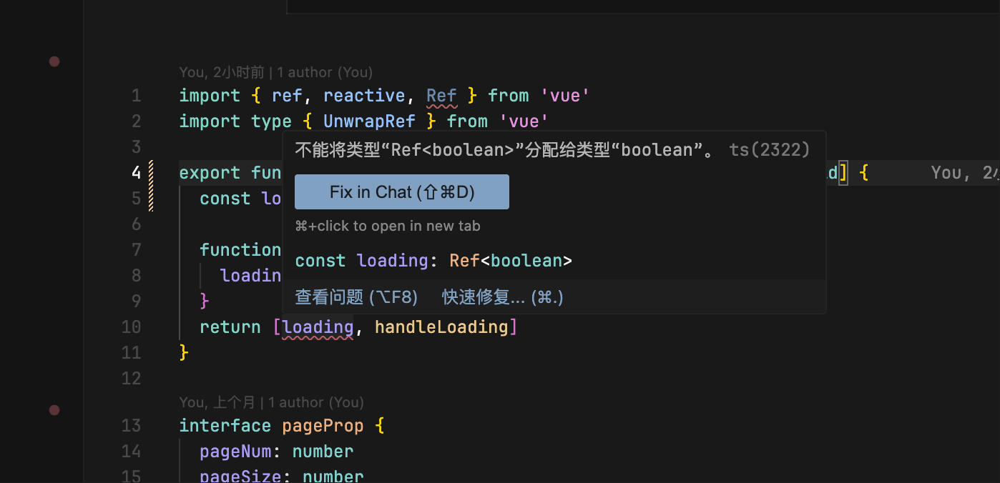
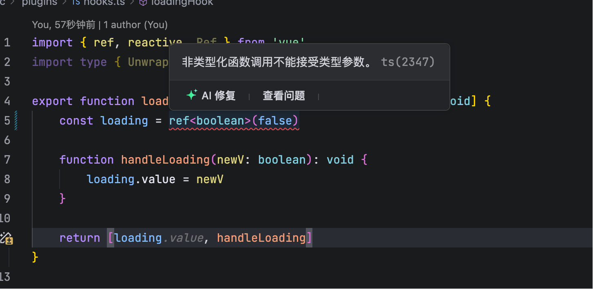

### 类型“{}”上不存在属性“theTitle”。ts-plugin(2339)
在`vue`文件中`template`区域中使用 `{{thTitle}}`提示该错误，

- 在tsconfig.json文件中，`compilerOptions`选项中添加`noImplicitAny`,并设置为false
```json
{
    "compilerOptions": {
        // 允许隐式的any类型
        "noImplicitAny": false,
    }
}
```
-若还是提示该错误，则尝试整个退出编辑器(退出进程那种)，然后重新打开

### 不能调用可能是“未定义”的对象。ts(2722)

```js
//报错写法
props.editCallBack(true);

// 纠正
if (props.editCallBack) {
    props.editCallBack(true);
}

// 原因 editCallBack 声明时是可选属性
{
    ...
    editCallBack?:Function
}
```

### 不能将类型“Ref<boolean>”分配给类型“boolean”。ts(2322)

在浙创项目中，使用hooks编码提示



解决方法
- 输出 ref 类型使用 Ref，reactive 使用 UnwrapRef
```ts
import { ref, reactive, Ref } from 'vue'
import type { UnwrapRef } from 'vue'

export function loadingHook(): [Ref<boolean>, (newV: boolean) => void] {
  const loading = ref(false)

  function handleLoading(newV: boolean): void {
    loading.value = newV
  }
  return [loading, handleLoading]
}

interface pageProp {
  pageNum: number
  pageSize: number
  total: number
}

export const pageHook = (): [UnwrapRef<pageProp>, (num: number, size: number) => void, (newV: number) => void] => {
  const pageInfo = reactive<pageProp>({
    pageNum: 1,
    pageSize: 10,
    total: 0,
  })

  const setPage = (num: number, size: number) => {
    pageInfo.pageNum = num
    pageInfo.pageSize = size
  }

  const setTotal = (newV: number) => (pageInfo.total = newV)

  return [pageInfo, setPage, setTotal]
}
```
- 在文件其实行添加 ts-nocheck 规避校验
```ts
// @ts-nocheck
```
- 在根目录的d.ts文件(已引入tsconfig.json)，加入vue声明，但是这个会关闭所有vue文件的类型检查导致失去typescript初衷，不建议这样做
  ```ts
    declare module 'vue'
  ```

### 非类型化函数调用不能接受类型参数。

上述 loadingHook 相同代码复制到算法模型平台项目会提示不需要使用 ref



- 解决方案

```ts
export function loadingHook(): [boolean, (newV: boolean) => void] {
	const loading = ref(false)

	function handleLoading(newV: boolean): void {
		loading.value = newV
	}

	return [loading, handleLoading]
}
```
发现项目中有为vue添加声明 `declare module 'vue'`

可以通过 `find . -name "*.d.ts" -type f` 命令查找项目中 d.ts 配置文件

### tsconfig 提示“无法写入文件，因为它会覆盖输入文件”

通常是因为 allowJs 选项被启用，并且TypeScript 编译器试图将 .js 源文件编译成同名的 .js 输出文件。解决此问题的方法是 设置 outDir 选项来指定一个单独的输出目录，或者 在使用打包工具（如Webpack）时关闭 allowJs 选项，并将TypeScript 编译和JS 文件的处理交给打包工具完成。

```json
// tsconfig.json
{
  "compilerOptions": {
    "outDir": "./dist", // 指定输出目录
    "allowJs": true // 如果需要处理JS文件，保持此项
    // ... 其他配置项
  }
}
```