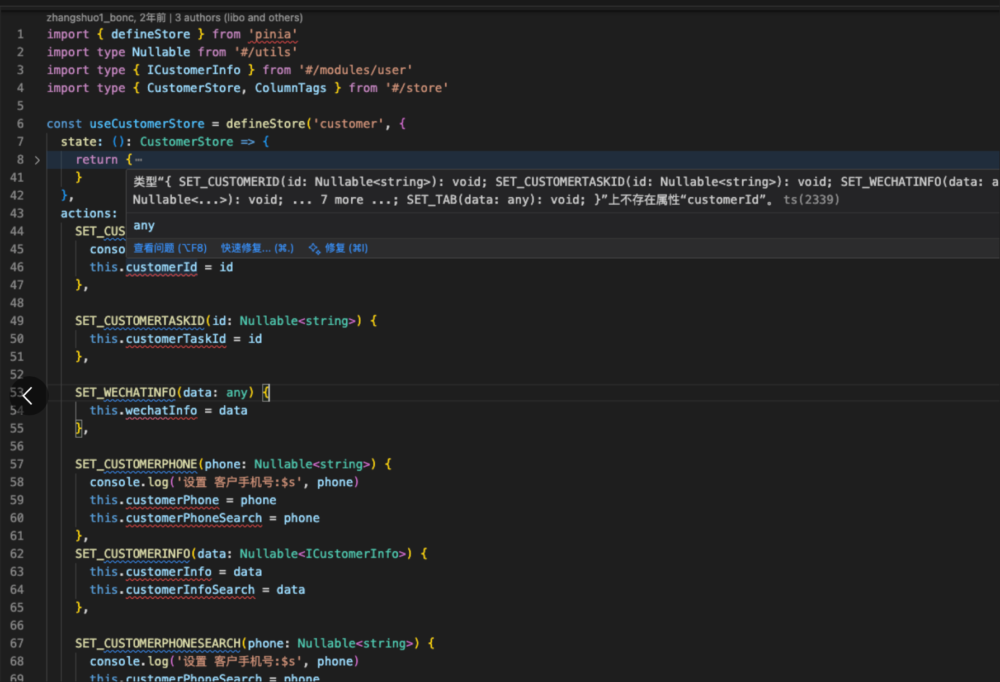

相同的插件可能会由于 插件版本 或者 typescript 版本不一致导致在个别项目中报错，个别项目正常。

### pinia + vue

在 pinia@2.0.14 + vue@3.2.25 中编写的状态管理文件不会报错

```ts
import { defineStore } from 'pinia'
import type Nullable from '#/utils'
import type { CustomerStore } from '#/store'

const useCustomerStore = defineStore('customer', {
  state: (): CustomerStore => {
    return {
      // 客户id
      customerId: null,
      // 客户手机号 -- 和代办任务列表同步
      customerPhone: null,
      // 客户信息 -- 和代办任务列表同步
      customerInfo: null,
  },
  actions: {
    SET_CUSTOMERID(id: Nullable<string>) {
      this.customerId = id
    },

    SET_CUSTOMERPHONE(phone: Nullable<string>) {
      this.customerPhone = phone
    },
    SET_CUSTOMERINFO(data: Nullable<ICustomerInfo>) {
      this.customerInfo = data
    },
  }
})

export default useCustomerStore
```

但是相同编码，在 pinia@^3 + vue@^3 中会提示



问题原因：在高版本 Pinia 的 actions 中，TypeScript 将 this 推断为仅包含 actions，不包含 state，因此访问 this.operatorId 等会报错。

解决方案

- 为每个 action 的 this 显式标注为 类型
```ts
 actions: {
    SET_CUSTOMERID(this:CustomerStore,id: Nullable<string>) {
      this.customerId = id
    },

    SET_CUSTOMERPHONE(this:CustomerStore,phone: Nullable<string>) {
      this.customerPhone = phone
    },
    SET_CUSTOMERINFO(this:CustomerStore,: Nullable<ICustomerInfo>) {
      this.customerInfo = data
    },
  }
```
- 使用any推断
```ts
 actions: {
    SET_CUSTOMERID(id: Nullable<string>) {
        const state = this as any
        state.customerId = id
    }
  }
```
- 在单行报错前添加 @ts-ignore 规避校验
```ts
 actions: {
    SET_CUSTOMERID(id: Nullable<string>) {
        // @ts-ignore
        this.customerId = id
    }
  }
```
- 在文件其实行添加 ts-nocheck 规避校验
```ts
// @ts-nocheck
```

