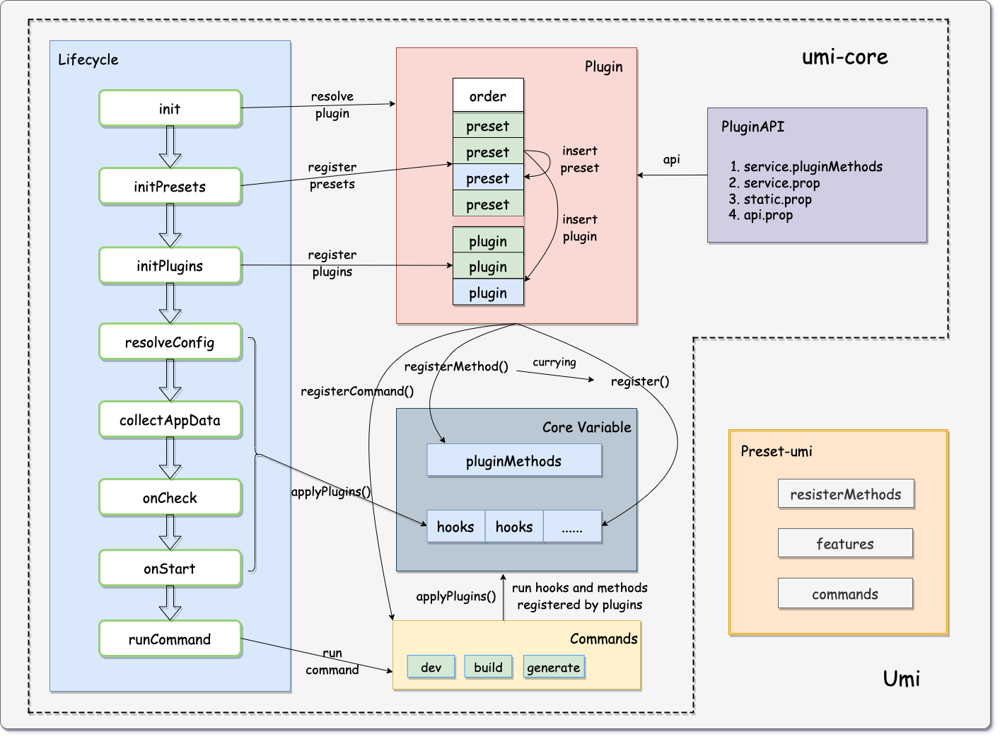

umi 中使用插件开发可以获得扩展项目的编译时和运行时的能力。你可以利用我们提供的 插件API 来自由地编写插件，进而实现修改代码打包配置、修改启动代码、约定目录结构、修改 HTML 等丰富的功能。

插件的本质就是一个方法，该方法接收了一个参数：api。在插件中，你可以调用 api 提供的方法进行一些 hook 的注册，随后 Umi 会在特定的时机执行这些 hook

官方链接：https://umijs.org/docs/guides/plugins

示例
``` 
// changeFavicon.js
import { IApi } from 'umi';

export default (api: IApi) => {
  api.describe({
    key: 'changeFavicon', // 唯一性
    config: {
      schema(joi) {
        return joi.string();
      },
    },
    enableBy: api.EnableBy.config
  });
  api.modifyConfig((memo)=>{
    memo.favicons = api.userConfig.changeFavicon;
    return memo;
  });
};
```

使用

```
export default defineConfig({
    plugins: ['./changeFavicon.js'] // 从项目根路径解析
})
```

在开发使用钩子中，需要注意钩子函数的生命周期

