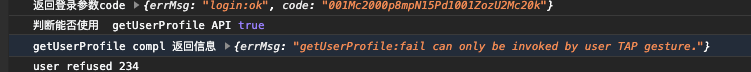
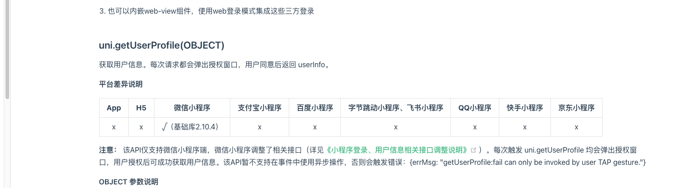
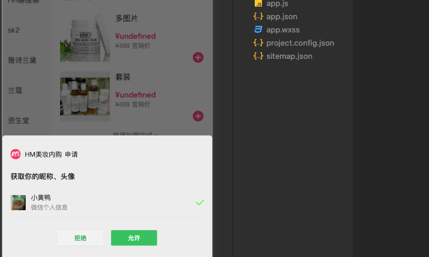

小程序中 新加入的 getUserProfile API 不能伴随使用异步方法或者防抖方法，会提示 getUserProfile:fail can only be invoked by user TAP gesture."

画眉内购小程序中使用
```
WxUserProfile(e) {
    loginFunc().then(res => {
        weixinUser().then(infoRes => {
            console.log(infoRes, '234');
            this.$axios
                .post(`${apis.USER.hmLogin}`, {
                    code: res.code,
                    nickName: infoRes.userInfo.nickName,
                    avatarUrl: infoRes.userInfo.avatarUrl
                })
                .then(backData => {
                    console.log('数据反显结果', backData);
                });
        });
    });
}
```
 结果：



查阅资料发现



更改为直接调用
```
template：
    <button
        v-if="!userProfile.guid"
        class="btn-section"
        @click="WxUserProfile"
    ></button>
```
方法中：
```
getUserProfile() {
    wx.getUserProfile({
        desc: '用于完善资料，提供更好体验', // 声明获取用户个人信息后的用途，后续会展示在弹窗中，请谨慎填写
        success: res => {
            console.log('getUserProfile获取用户信息结果', res);
            // result = res;
        },
        complete: compl => {
            // 执行
            console.log('getUserProfile compl 返回信息', compl);
        },
        fail: () => {
            result = 'user refused';
        }
    });
},
```

直接调用可以出现弹窗

