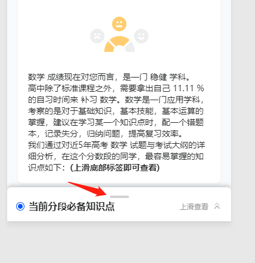

### 模拟滑入滑出

uni-app2示例代码
```js
 <scroll-view
            :class="{ 'keep-bottom': true }"
            :style="{
                height: currentHeight + 'px',
                bottom: bottomHeight + 'px'
            }"
            ref="scrollArea"
            class="kownledge-area"
            scroll-y="true"
            @scrolltoupper="upper"
            @scrolltolower="lower"
            @scroll="scroll"
        >
            <view
                class="kownledge-top"
                :style="{ 'margin-top': haveTop + 'px' }"
            ></view>
            <view class="kownledge-title">
                <view class="title-style">
                    <view class="point-style"></view>
                    当前分段必备知识点</view
                >
                <view class="arrow-desc">
                    <text v-if="!isOpen" @tap="_show()">上滑查看</text>
                    <text v-else @tap="_cancel()">下滑关闭</text>
                    <image
                        class="arrow-img"
                        :class="{ 'turn-down': isOpen }"
                        src="https://file.turingtopia.com/h5/applet/v104/sprint/report/arrowd.png"
                    ></image> </view
            ></view>
        </scroll-view>
        <view v-if="isOpen" class="tki-tree-cnt" :class="{ show: showTree }">
            <!-- 打开关闭控制栏 -->
            <!-- <view class="tki-tree-bar">
                <view
                    class="tki-tree-bar-cancel"
                    :style="{ color: cancelColor }"
                    hover-class="hover-c"
                    @tap="_cancel"
                    >取消</view
                >
                <view
                    class="tki-tree-bar-title"
                    :style="{ color: titleColor }"
                    >{{ title }}</view
                >
                <view
                    class="tki-tree-bar-confirm"
                    :style="{ color: confirmColor }"
                    hover-class="hover-c"
                    @tap="_confirm"
                    >确定</view
                >
            </view> -->
            <view class="tki-tree-view">
                <scroll-view class="tki-tree-view-sc" :scroll-y="true">
                    <block v-for="(item, index) in treeList" :key="index">
                        <view
                            class="tki-tree-item"
                            :style="[
                                {
                                    paddingLeft: item.rank * 15 + 'px',
                                    zIndex: item.rank * -1 + 50
                                }
                            ]"
                            :class="{
                                border: border === true,
                                show: item.show,
                                last: item.lastRank,
                                showchild: item.showChild,
                                open: item.open
                            }"
                        >
                            <view
                                class="tki-tree-label"
                                @tap.stop="_treeItemTap(item, index)"
                            >
                                <image
                                    class="tki-tree-icon"
                                    :src="
                                        item.lastRank
                                            ? lastIcon
                                            : item.showChild
                                            ? currentIcon
                                            : defaultIcon
                                    "
                                ></image>
                                {{ item.name }}
                            </view>
                            <!-- 注释选择框 -->
                            <!-- <view
                                class="tki-tree-check"
                                @tap.stop="_treeItemSelect(item, index)"
                                v-if="selectParent ? true : item.lastRank"
                            >
                                <view
                                    class="tki-tree-check-yes"
                                    v-if="item.checked"
                                    :class="{ radio: !multiple }"
                                    :style="{ 'border-color': confirmColor }"
                                >
                                    <view
                                        class="tki-tree-check-yes-b"
                                        :style="{
                                            'background-color': confirmColor
                                        }"
                                    ></view>
                                </view>
                                <view
                                    class="tki-tree-check-no"
                                    v-else
                                    :class="{ radio: !multiple }"
                                    :style="{ 'border-color': confirmColor }"
                                ></view>
                            </view> -->
                        </view>
                    </block>
                </scroll-view>
            </view>
        </view>

methods(){
        upper(e) {
            console.log(e);
            this.currentHeight = 36;
            this.isOpen = false;
            this.bottomHeight = 0;
            this._hide();
        },
        lower(e) {
            console.log(e);
            // this.offsetTop = e.target.offsetTop;
            // this.currentHeight = 446;
            this.isOpen = true;
            this._show();
            this.bottomHeight = 446;
        },
        scroll(e) {
            console.log(e);
            this.old.scrollTop = e.detail.scrollTop;
        },
        _show() {
            this.showTree = true;
            // this.offsetTop = e.target.offsetTop;
            this.bottomHeight = 446;
            this.isOpen = true;
        },
        _hide() {
            this.showTree = false;
        },
        _cancel() {
            // this._hide();
            this.upper();
            this.haveTop = 0;
            this.$nextTick(() => {
                this.haveTop = 7;
            });
            this.$emit('cancel', '');
        },
}
```
// 详细代码见Yk-Uniapp中组件里的TkiTree文件

通过`scroll-view`组件里的`scrolltoupper`和`scrolltolower`方法改变`tki-tree-cnt`区域的展示与隐藏


上图中圈出区域的scrolltoupper等方法是通过触发改区域的滚动条实现
ps：要实现点击图中黑块区域也能关闭浮窗效果，可以通过_cancel方法实现，需要注意方法中的            
```
this.haveTop = 0;
this.$nextTick(() => {
    this.haveTop = 7;
});
```
若缺少这几句代码，关闭浮窗后，无法再次通过scrolltoLower打开浮窗，而需要先调用scrolltoupper(下滑)后才能scrolltoLower(上滑)打开浮窗

因为


通过scrolltoupper方法后可以发现途中箭头所指的灰色区域到顶部的距离发生变化，正如上面提到的是通过滑动滚动条触发。如果只是点击图中灰色区（触发_cancel方法）无法触发scroll-view区域的滚动条，想要再次打开则需要先回复其滚动条状态，即先调用scrolltoupper(下滑)后才能scrolltoLower(上滑)打开浮窗
所以添加
```
this.haveTop = 0;
this.$nextTick(() => {
        this.haveTop = 7;
});
```


重置灰色区域的margin-top值，先置0再恢复正常，从而恢复scroll-view区域的滚动条状态
