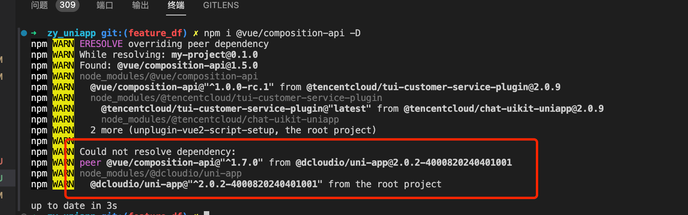

uniapp2 集成tuikit插件

参考 tuikit (https://cloud.tencent.com/document/product/269/64506) 步骤 将 TUiKIT 代码集成到原小程序代码中


引入tuikit组件之后的目录结构， tuiikit作为一个分包使用


启动项目可能会提示
```
Failed to compile with 1 errorERROR
errorin ./src/TuIKit/components/TuIConversation/index.vue?vue&type=script&lang-ts&
Module parse failed: Unexpected token(40:51)
File was processed with these loaders:
*./node modules/@dcloudio/vue-cli-plugin-uni/packages/webpack-preprocess-loader/index. js./node modules/@dcloudio/vue-cli-plugin-uni/packages/webpack-uni-app-loader/using-components . js./node modules/@dcloudio/vue-cli-plugin-uni/packages/vue-loader/lib/index.js
./node modules/@dcloudio/vue-cli-plugin-uni/packages/webpack-scoped-loader/index.js./node modules/unplugin/dist/webpack/loaders/transform.jsYou may need an additional loader to handle the result of these loaders
const emits=ctx.emit;
const totalUnreadCount = ref(0);
const headerRef =ref<typeof ConversationHeader>();
const conversationListDomRef =ref<typeof ConversationList>();
const touchX= ref<number>(0);
```
这个问题应该是项目没有集成ts开发导致

解决办法：
```
npm i typescript -D
npm i @vue/cli-plugin-typescript@4 -D
```
1.依次执行上诉代码，安装ts相关依赖
2.根目录下添加tsconfig.json文件
```
// tsconfig.json
{
    "compilerOptions": {
        "target": "esnext",
        "module": "esnext",
        "strict": true,
        "jsx": "preserve",
        "moduleResolution": "node",
        "esModuleInterop": true,
        "sourceMap": true,
        "skipLibCheck": true,
        "importHelpers": true,
        "allowSyntheticDefaultImports": true,
        "useDefineForClassFields": true,
        "resolveJsonModule": true,
        "lib": ["esnext", "dom"],
        "types": ["@dcloudio/types"]
    },
    "exclude": ["node_modules", "unpackage", "src/**/*.nvue"]
}
```
安装完ts依赖，再次启动项目终端不会报错，但是进入 tuikit页面提示报错，uniapp2使用的是vue2版本，使用vue3语法会报错


解决方法：

安装 @vue/composition-api 插件，可以支持在 vue2中使用vue3语法，现最新版本为1.7.2
```
npm install @vue/composition-api -D
```
在main.js文件中声明使用

如果没有安装 vue-template-compiler 一并安装下与vue相同的版本。它的作用是将 Vue 单文件组件中的模板代码编译为 JavaScript 渲染函数。在开发环境中，Vue.js 会在运行时动态编译模板，但在生产环境中，为了提高性能，通常会预先将模板编译成渲染函数，这个过程就是由 

`vue-template-compiler` 完成的。
```
npm install vue-template-compiler -D
```
```
import Vue from 'vue'
import VueCompositionAPI from '@vue/composition-api'

Vue.use(VueCompositionAPI)
```
tuikit中存在使用@dcloudio/uni-app插件
```
import { onHide } from "@dcloudio/uni-app"
```
检查是否需要安装 @dcloudio/uni-app 插件

启动项目可能会提示项目 
```
error  in ./src/TUIKit/components/TUIChat/message-input-toolbar/emoji-picker/emoji-picker-dialog.vue?vue&type=script&lang=ts&setup=true&
Syntax Error: Unexpected token (139:27)
…………
```
前往报错处，发现是代码书写错误


纠正

然后重启项目，打开tuikit组件页面，微信开发者工具日志报错提示：
```
TypeError: (0 , composition_api_1.createLifeCycle) is not a function，
```
可能是vue3语法转译失败 或者 @vue/composition-api 版本问题


发现 adaper-vue.ts 已导出了vue3相关语法
```
// adaper-vue.ts 代码内容
let vueVersion: number;
let framework = "vue2";
// #ifndef VUE3
// vue2项目导出
export * from "@vue/composition-api";
vueVersion = 2;
// #endif

// #ifdef VUE3
export * as api from "vue";
vueVersion = 3;
framework = "vue3";
// #endif
console.warn(`[adapter-vue]: vue version is ${vueVersion}`);
// console.log("ref", ref);
export { vueVersion, framework };
```
查看安装依赖时输出信息



1.7.*(现最新版)的 @vue/composition-api 与 @dcloudio/uni-app 可能不兼容，安装 1.5版本后重启项目

```
npm i @vue/composition-api@1.5 -D 
```


查看代码发现项目里 onHIde是从 @dcloudio/uni-app 中引入
```
import { onHide } from "@dcloudio/uni-app";
```
接着通过 @dcloudio/uni-app 源码发现  createLifeCycle 报错源


