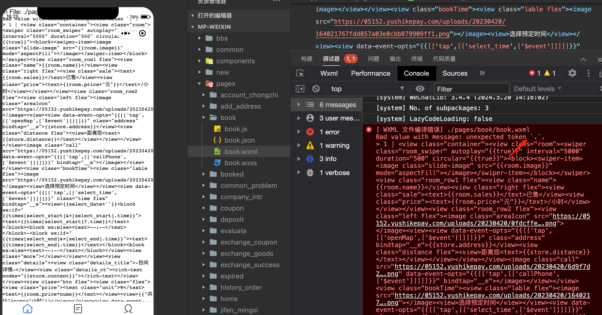

微信开发工具中 wxml 文件中如果有 ?.  可能会编译报错

如：
<view>
    {{ select_date }}{{ times[select_start]?.time || '--:--' }} - {{ times[select_end]?.time || '--:--' }}
</view>
// 或者
<view class="old-price" v-if="type === 0 && coupon?.id">{{ coupon.price }}</view>
将双扩号中的?. 改到 v-if 判断或者js方法返回

<view>
    {{ select_date }}
    <text v-if="times[select_start] && times[select_start].time">
        {{times[select_start].time}}
    </text>
    <text v-else>--:--</text> -
    <text v-if="times[select_end] && times[select_end].time">
        {{times[select_end].time}}
    </text>
    <text v-else>--:--</text>
</view>
