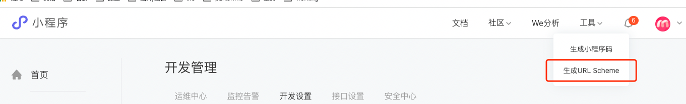
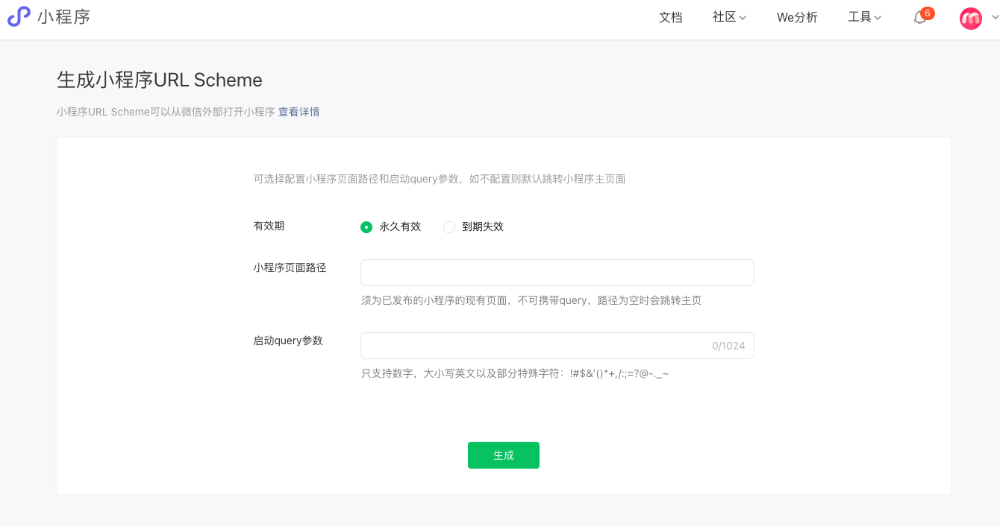
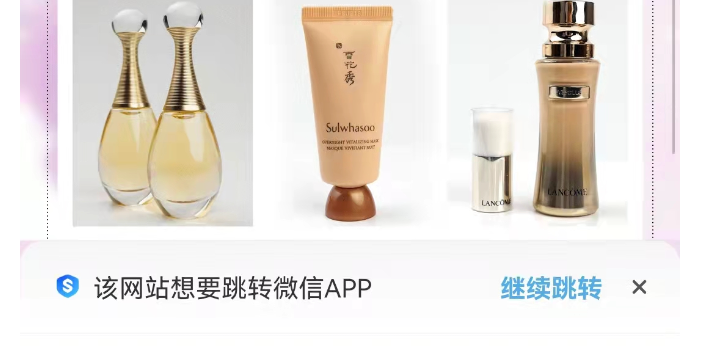
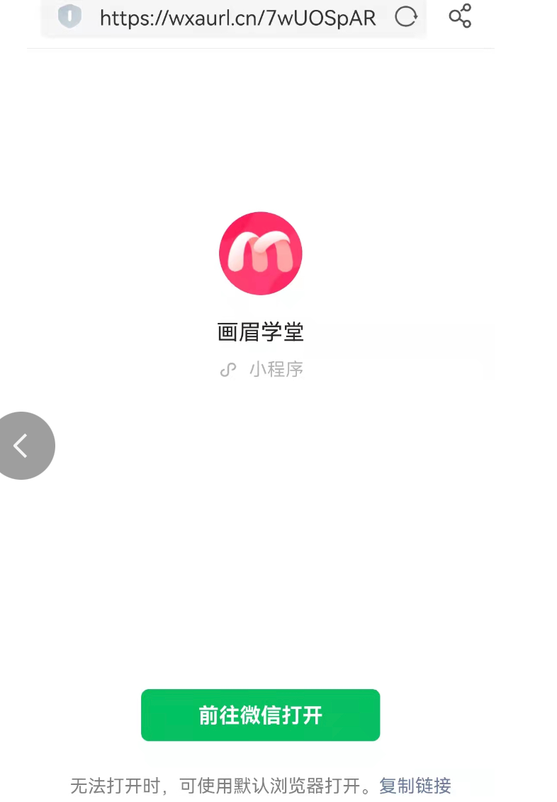

### 微信小程序 生成 外部打开小程序链接

#### 1. 使用 url schema

使用小程序相关账号登陆微信公众平台 —— 在顶部导航栏选择工具 —— 点击生成 URL Schema





根据可选设置参数 生产目标链接 ，直接点击链接，或者在代码中使用 location.href 即可

```
location.href = urllink
```

这种方法生成的链接可以直接跳转到小程序，但是可能会被某些浏览器拦截提示是否继续打开



#### 2.generate_urllink

生成方法的介绍  [generate_urlLink](https://developers.weixin.qq.com/miniprogram/dev/OpenApiDoc/qrcode-link/url-link/generateUrlLink.html)

调用 urllink.generate 还需要使用凭证（凭证介绍 accessToken）
根据官方提示 generate_urllink 与获取凭证接口 都应该在服务端调用，但考虑到 我们使用 nuxt 项目是有服务端的，所以应该可以在 asyncData() 或者 fetch() 中调用，普通方法中调用会提示跨域不支持，可能是微信出于安全考虑不让在 network 中查看请求数据，

但是直接在浏览器网址栏输 凭证接口是可以成功返回access_token的，所在在asyncData() 中调用是可行的

```
https://api.weixin.qq.com/cgi-bin/token?grant_type=client_credential&appid=APPID&secret=APPSECRET
```

在asyncData 中添加 generate_urllink 方法
```js
    asyncData({ app }) {
    // 不能在前台请求 需要在服务端请求 所以写在这里
    let accessToken = '';
    return app.$axios
        .get(
            `https://api.weixin.qq.com/cgi-bin/token?grant_type=client_credential&appid=${yourAppid}}&secret=${yourSecret}}`
        )
        .then(acessInfo => {
            // console.log('凭证数据', acessInfo.data.access_token);
            accessToken = acessInfo.data.access_token || '';
        })
        .then(() => {
            // console.log('请求结果', accessToken);
            if (accessToken) {
                return app.$axios
                    .post(
                        `https://api.weixin.qq.com/wxa/generate_urllink?access_token=${accessToken}`,
                        {
                            path: 'pages/official'
                        },
                        {
                            headers: {
                                'Content-Type': 'application/json'
                            }
                        }
                    )
                    .then(res => {
                        // console.log('res', res.data);
                        return {
                            accessToken,
                            targetUrl: res.data
                        };
                    });
            }
        });
    },
```

通过使用 locaiton.href 方法实现跳转，但是这种方法生产的链接会改变网页地址到生成的链接



更多可参考：

https://developers.weixin.qq.com/miniprogram/dev/framework/open-ability/url-scheme.html

https://mp.weixin.qq.com/s/QyJ4XKgaYH-517PEElhwrg