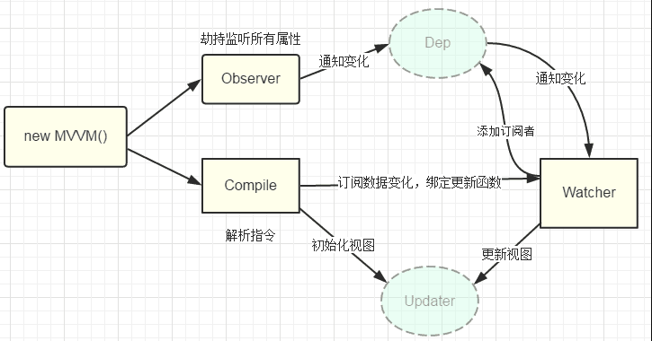

vue是双向绑定框架：
1. 数据层（Model）：应用的数据及业务逻辑
2. 视图层（View）：应用的展示效果，各类UI组件
3. 业务逻辑层（ViewModel）：框架封装的核心，它负责将数据与视图关联起来，它的主要职责就是：
- 数据变化后更新视图
- 视图变化后更新数据
当然，它还有两个主要部分组成：
- 监听器（Observer）：对所有数据的属性进行监听
- 解析器（Compiler）：对每个元素节点的指令进行扫描跟解析,根据指令模板替换数据,以及绑定相应的更新函数

流程如下：

1. new Vue()首先执行初始化，对data执行响应化处理，这个过程发生Observe中
2. 同时对模板执行编译，找到其中动态绑定的数据，从data中获取并初始化视图，这个过程发生在Compile中
3. 同时定义⼀个更新函数和Watcher，将来对应数据变化时Watcher会调用更新函数
4. 由于data的某个key在⼀个视图中可能出现多次，所以每个key都需要⼀个管家Dep来管理多个Watcher
5. 将来data中数据⼀旦发生变化，会首先找到对应的Dep，通知所有Watcher执行更新函数
 
#### 在vue2与vue3中进行数据劫持的方法不同：

vue2.0 采用的是Object.defineProperty进行数据劫持的

主要实现原理是使用描述对象中的set方法进行拦截,并发送订阅器信号

```js
let dep = new Dep()
return Object.defineProperty(obj, prop, {
    // ...
    get: function(key) {
        dep.target = this
        dep.addSub()
        // ...
    }
    set: function(newVal) {
        val = newVue;
        // 发送一个dep信号
        dep.notify()
        // ...
    }
})
```

而vue3.0中可能会采用Proxy来实现数据劫持

```js
let target = {}

let p = new Proxy(target, {
    set: function() {
        //...
    },
    get: function() {
        //...
    }
})
```

为啥呢？
我们知道 Object.defineProperty 是有局限性的，他的拦截的 target 就是单纯的对象的key的值
所以呢，对象属性的删减，数组，数组长度的改变，它就没法进行劫持了. 

而 ES6 的新特性，Proxy，它可以拦截对象，数组几乎一切对象包装类型
但是 Proxy 没法兼容 IE，所以 Vue3.0 底层还是采用 Object.defineProperty
而 使用 Proxy 作为一个 api ，也就是说：
我们不兼容IE， 就大胆用 Proxy 双向绑定而且不会有属性删减和数组劫持不到的问题
我们要兼容IE，就用原来的双向绑定，但是要注意它的不能劫持部分变化的缺陷

从上图我们可以看到，Observer 观察了 object 值的变化，这是一种观察者模式
而 Observer 将观察的信号发布给订阅器这是一种 发布订阅模式

什么是观察者模式，首先有一个观察者，一个被观察者，被观察者这里是数据，而观察者是Observer，被观察者发生变化时，主动发生信号给被观察者


按照这个思路来说，我们也能想象尤大，当时设计双向绑定时候，思考怎样去监听这个数据的变化，也就是如何使用观察者模式来实现，而恰好对一个对象的处理中有个对象方法我们可以使用，就是 Object.defineProperty

假如没有这个方法我们怎么实现呢？
这就是 angular 的另外一种实现方式脏检测，也就是不停的轮询数据的变化情况，显然脏检测对性能消耗比较大

再谈谈发布订阅模式

在软件架构中，发布订阅是一种消息范式，消息的发送者（称为发布者）不会将消息直接发送给特定的接收者（称为订阅者）。而是将发布的消息分为不同的类别，无需了解哪些订阅者（如果有的话）可能存在。同样的，订阅者可以表达对一个或多个类别的兴趣，只接收感兴趣的消息，无需了解哪些发布者（如果有的话）存在。

这里很明显了，区别就在于，不同于观察者和被观察者，发布者和订阅者是互相不知道对方的存在的，发布者只需要把消息发送到订阅器里面，订阅者只管接受自己需要订阅的内容

由此发布订阅模式是一种松耦合的关系，watcher 和 Observer 之间是互相不受影响

