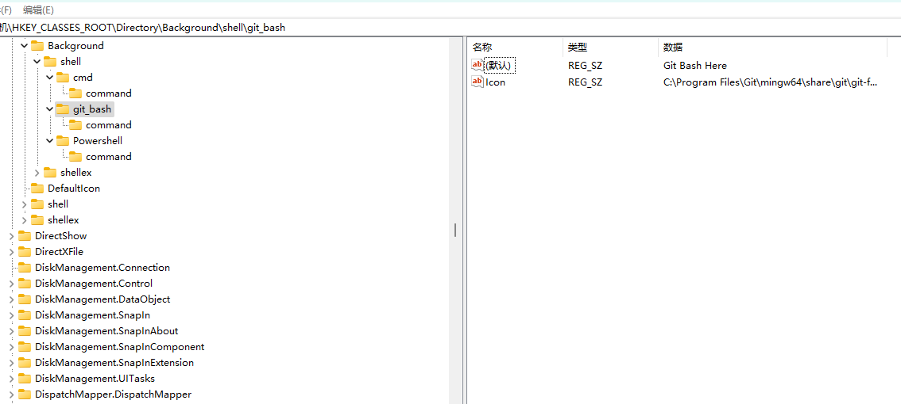

1、通过在“运行”（Win+R）中输入‘regedit’，打开注册表。

2、找到[HKEY_CLASSES_ROOT\Directory\Background]。

3、在[Background]下如果没有[shell],则右键-新建项[shell]。

4、在[shell]下右键-新建项[open in git],其值为“Git Bash Here",此为右键菜单显示名称。

5、在[shell]下右键-新建-字符串值[Icon],双击编辑，其值为“C:\Program Files\Git\mingw64\share\git\git-for-windows.ico”。此为菜单加图标。

6、在[open in git]下右键-新建-项[command],其值为"C:\Program Files\Git\bin\bash.exe"。

