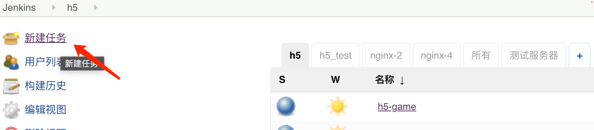
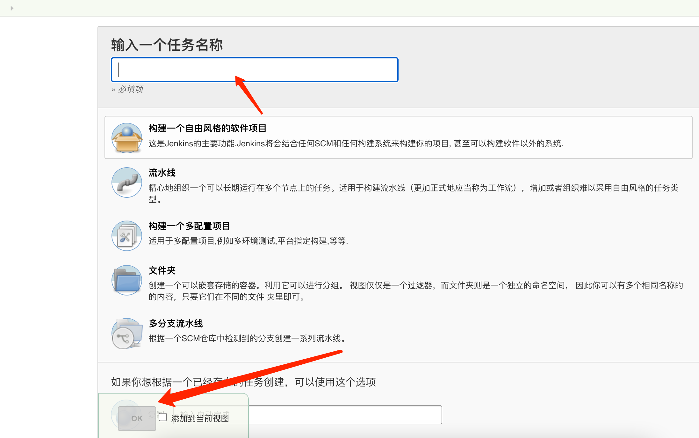
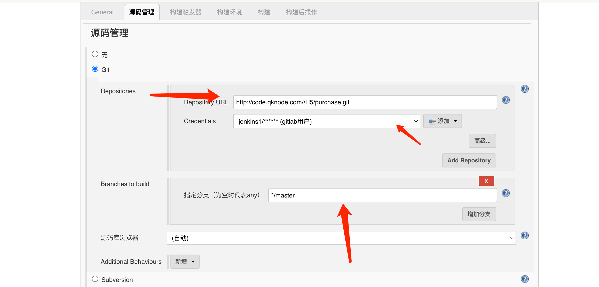
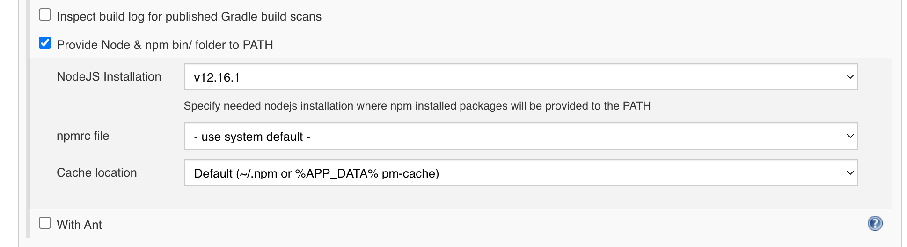
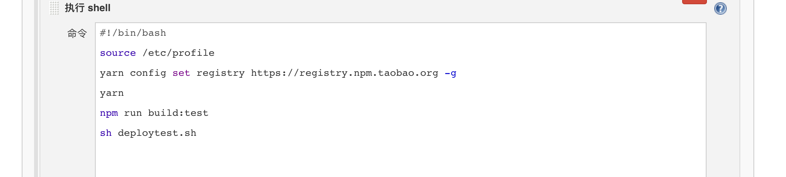

1.为要部署的项目在 jekins 新建任务



2. 输入任务名称，选到“构建一个自由风格的软件项目” ，然后点击“ok”
   


3. 源码管理 选到要现有的代码仓库地址，用户以及相应的分支



4. 根据需要添加执行命令



5. 添加构建脚本



```#!/bin/bash

source /etc/profile // 首先 source 加载资源

yarn config set registry https://registry.npm.taobao.org -g // yarn 设定淘宝镜像方便安装yarn依赖

yarn // 安装依赖

npm run build:test // 打包

sh deploytest.sh // 执行项目中的依赖
```

其中 deploytest.sh 中配置如下
```#!/bin/sh

# 获取版本号
config=`sed -n '1p' config/index.ts |awk -F '= ' '{print $2}'`
version=${config:1:4}

# 获取当前路径
path=$(cd `dirname $0`; pwd)

# 设置包名称
cdnFolder=purchase
folder=h5-test-$cdnFolder

#有的需要cdn压缩包
cd .nuxt/dist/client
tar -zcf $path/version/$version.cdn.tar.gz ./*

#进入上上级
cd ../../..
# 将需要的配置文件以及打包文件压缩成包
tar -zcf $path/version/$version.source.tar.gz .nuxt assets server static package.json tsconfig.json nodemon.json app.html ecosystem.config.js node_modules config nuxt.config.ts

# scp ./version/$version.cdn.tar.gz tuijian@qk-nginx-1:/data01/www/protal/h5/$cdnFolder
# ssh tuijian@qk-nginx-1 "cd /data01/www/protal/h5/$cdnFolder && sh unzip.sh $version"
# echo 'cdn 更新完成'

# scp ./version/$version.source.tar.gz tuijian@qk-front-2:/home/tuijian/app/$folder
# ssh tuijian@qk-front-2 "cd /home/tuijian/app/$folder && sh update.sh $version"
# echo 'qk-front-2 更新完成'

# 将上一步打包文件解压到服务器对应项目的prod中
scp ./version/$version.source.tar.gz tuijian@qk-front-4:/home/tuijian/app/$folder

# 进入服务器 并执行更新脚本 脚本带版本参数
ssh tuijian@qk-front-4 "cd /home/tuijian/app/$folder && sh update.sh $version"

# update.s 脚本执行完成，输出更新完成
echo 'qk-front-4 采购平台 测试环境 更新完成'
```
此外需注意在项目首次运行时，需要手动起服务
```
$ yarn run start
```

查看配置脚本发现 
// package.json 中

script:{
    …………
   "start": "cross-env NODE_ENV=production pm2 start ecosystem.config.js",
    …………
}
我们配置的“yarn run start” 命令，设置了cross-env环境参数，并设置当前环境，然后通过“pm2 start ecosystem.config.js” 启动，运行玩可以通过
“pm2 list” 查看到启动的进程, 这是为了方便自动化部署”pm2 reload name“ 生效, 此外存在一些个别情况，如type-script项目需要安装 ts-node 和 typescript，个别时候需要停掉整个pm2进行重启
```
$ pm2 stop all

$ pm2 restart all
物理情况：查看cpu使用情况，过高会影响项目运行情况
```
update.sh
```#!/bin/sh

# 获取传入的版本参数
version=$1
    # 没有就生成解压的目标地址
    mkdir ./prod
    # 解压
    tar -zxf ./$version.source.tar.gz -C ./prod

# 通过bin终端无缝重启进程
/home/tuijian/.nvm/versions/node/v12.16.1/bin/pm2 reload purchase
```
之后更新就可以通过jekins自动化部署了,
