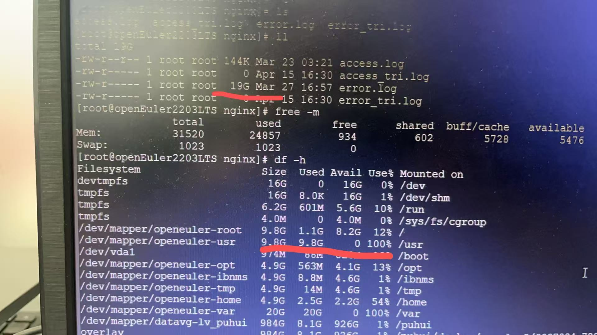

浏览器控制台报错 net::ERR_CONTENT_LENGTH_MISMATCH 200


加载前端静态页面提示错误，但不是所有的js或css 报错，报错的文件较没报错的文件偏大。并且报错的文件也可以单独在浏览器中打开,所以排除了最简单的地址错误。前端项目是由nginx代理的，所以可以查看nginx的日志



发现由于磁盘资源占用拉满，导致nginx代理获取较大静态资源文件时失败

需要定期修改日志

手动清理
```
mv /usr/local/nginx/logs/access.log /usr/local/nginx/logs/access.log.bak  #重命名日志文件
mv /usr/local/nginx/logs/error.log /usr/local/nginx/logs/error.log.bak    #重命名日志文件
/usr/local/nginx/sbin/nginx -s reopen #重执行生成日志文件
rm -rf  /usr/log/nginx/logs/access.log.bak #删除旧文件
rm -rf  /usr/local/nginx/logs/error.log.bak  #删除旧文件
```
或者使用 cat 清理
```
cat /dev/null > /usr/local/nginx/logs/access.log
cat /dev/null > /usr/local/nginx/logs/error.log
```

sh定期清理

在 del_logs.sh 文件中写入下面内容
```
# /usr/local/nginx/logs/del_logs.sh
#!/bin/bash
# 先复制原来的错误日志文件，请根据自己实际的日志路径填写
cp /usr/local/nginx/logs/error.log /usr/local/nginx/logs/error-$(date -d "yesterday" +"%Y%m%d").log
# 清空错误日志文件
cat /dev/null > /usr/local/nginx/logs/error.log
# 先复制原来的访问日志
cp /usr/local/nginx/logs/access.log /usr/local/nginx/logs/access-$(date -d "yesterday" +"%Y%m%d").log
# 清空原来的正常访问日志
cat /dev/null > /usr/local/nginx/logs/access.log
# 定期删除七天前的日志文件
find /usr/local/nginx/logs -mtime 7 -type f -name \*.log | xargs rm -rf
```
添加可执行权限
chmod +x del_logs.sh

添加Linux计划任务
crontab -e

写入下面内容
```
0 0 * * * /usr/local/nginx/logs/del_logs.sh
```

重启服务
```
systemctl restart crond
```
使用 `crontab -l` 查看调度计划，日志脚本是否添加