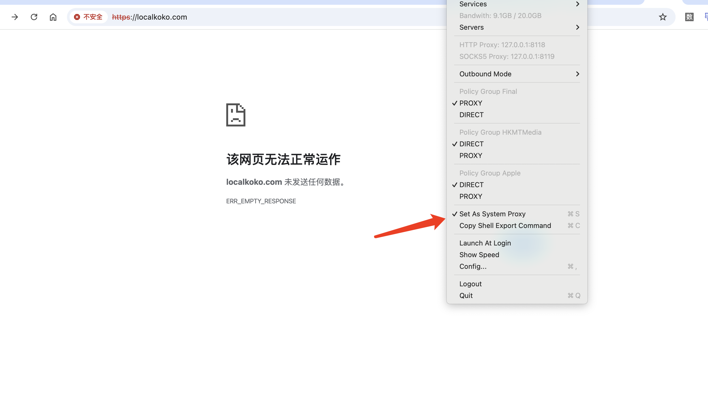
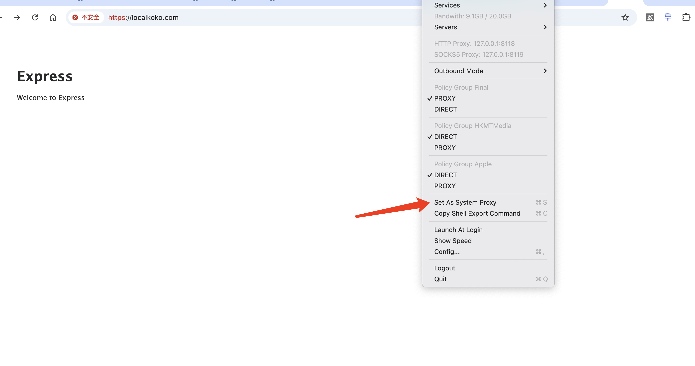
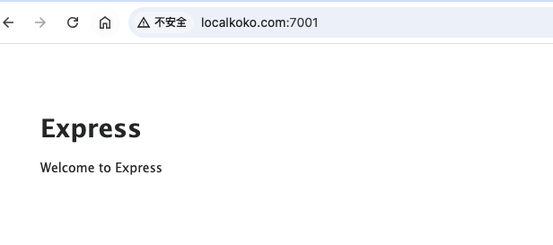

### 1.通过 openssl 命令自签证书
进入目标文件夹
```
openssl req -x509 -newkey rsa:4096 -keyout key.pem -out cert.pem -days 365
```
Enter PEM pass phrase:

如果你希望生成自签名证书时不需要输入密码并且直接输出 PEM 格式的私钥，可以使用以下 OpenSSL 命令：
```
openssl req -x509 -newkey rsa:4096 -keyout private-key.pem -out cert.pem -days 365 -subj "/CN=YourDomain" -nodes
```
- -subj 选项允许你通过命令行直接提供证书主题信息，而不必在交互式提示中输入。 
- -nodes 选项，表示不加密私钥，因此无需输入密码。
- 请替换 /CN=YourDomain 中的 YourDomain 为你的域名或标识。

生成后，可在目标文件夹下执行 `openssl x509 -in cert.pem -text -noout` 验证,正确结果如下：
```
Certificate:
    Data:
        Version: 3 (0x2)
        Serial Number:
            4d:20:0d:ba:3f:88:b0:97:3d:71:a3:ca:b4:67:ba:f5:eb:59:67:20
        Signature Algorithm: sha256WithRSAEncryption
        Issuer: CN = localkoko.com
        Validity
            Not Before: Apr 16 06:37:18 2025 GMT
            Not After : Apr 16 06:37:18 2026 GMT
        Subject: CN = localkoko.com
        Subject Public Key Info:
            Public Key Algorithm: rsaEncryption
                Public-Key: (4096 bit)
        ……
```

### 2.使用

1）nginx

打开你的 Nginx 配置文件（通常是 /etc/nginx/nginx.conf 或 /etc/nginx/conf.d/default.conf）。添加以下配置块：
```
server {
    listen 443 ssl;
    server_name your-domain.com;  # 替换成你的域名
    
    ssl_certificate /path/to/your/cert.pem;
    ssl_certificate_key /path/to/your/private-key.pem;
    
    # 可选：配置其他 SSL 相关选项
    ssl_protocols TLSv1.2 TLSv1.3;
    ssl_ciphers 'TLS_AES_128_GCM_SHA256:TLS_AES_256_GCM_SHA384';
    ssl_prefer_server_ciphers off;
    
    # 配置其他 Nginx 选项，比如代理等
    
    location / {
        # 配置反向代理或其他服务
        proxy_pass http://your-backend-server;
    }
}
```
另外，确保你的域名在你的 hosts 文件中正确映射到 127.0.0.1。这可以通过编辑操作系统的 hosts 文件来完成。在大多数系统中，hosts 文件位于以下位置：

- Windows: C:\Windows\System32\drivers\etc\hosts
- Linux/Mac: /etc/hosts

注意首次设置的签证域名，访问成功可能会有延时
  
在文件中添加一行类似于以下内容，如果有vpn代理，请取网络设置中的网页代理或是将your-domain.com添入忽略主机与域的表单中

```
127.0.0.1   your-domain.com
```

但是偶尔在VPN开启下设置hosts，还是会有打不开问题。如下开启代理访问失败



可能是VPN或者代理影响，请关闭后再次尝试



如果设置了host时，也可以直接浏览器访问域名+端口，如果本地node启动的7001端口，可以不使用nginx直接访问

