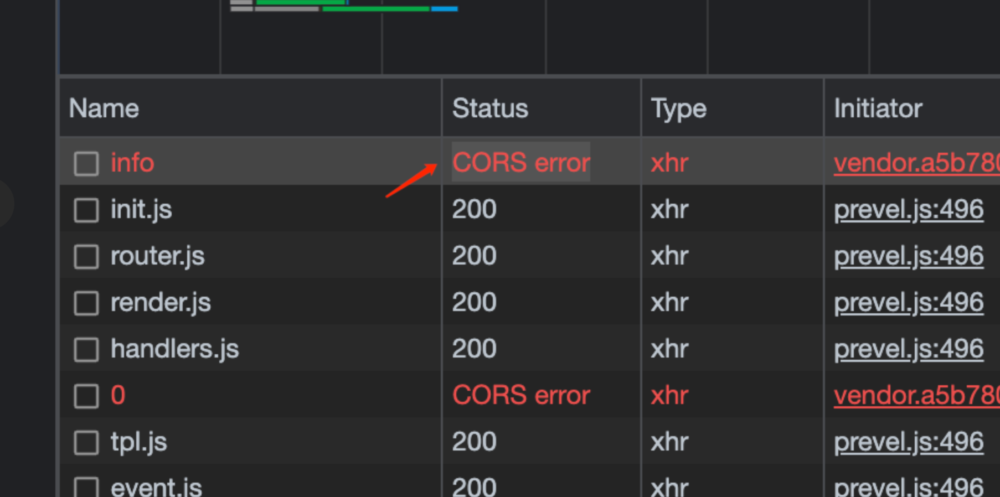

前端页面 140.210.90.44:5000/vip-manager-fe/……，页面中请求后端接口 140.210.90.44:8000/customervip……接口会提示跨域 “CORS error”



解决：在nginx做后端接口地址代理。前端还是5000去触发，由nginx代理到8000端口
```
{
    listen 5000;
    charset utf-8;
    server_name localhost;
    ……………………
    location /customervip {
        proxy_pass http://140.210.90.44:8000/customervip;
    }
}
```
在 Nginx 中，proxy_pass 是用于代理请求的指令。当你使用 proxy_pass 将请求代理到另一个服务器时，默认情况下，请求路径会被传递给目标服务器，但是其行为也可以根据配置的不同发生变化。

proxy_pass 的行为
1. 基本路径传递
假设你有以下 Nginx 配置：
```
location /api/ {
    proxy_pass http://backend/;
}
```
当你访问 http://your-nginx-server/api/users 时，Nginx 会将请求代理到 http://backend/users，并去除了 /api/ 前缀。这是因为 Nginx 的 proxy_pass 默认情况下会根据 location 块中的路径匹配部分进行去除。

2. 保留路径
如果你想将路径保持不变而传递到目标服务器，你可以使用不带尾随斜杠的 proxy_pass：
```
location /api/ {
    proxy_pass http://backend;
}
```
在这个例子中，Nginx 将会代理请求到 http://backend/api/users，即保持了 /api/ 路径不变。访问 http://your-nginx-server/api/users 会代理到 http://backend/api/users。

3. 带尾部斜杠的 proxy_pass
当 proxy_pass 末尾带有斜杠时，Nginx 会去除 location 中匹配的部分并将余下的路径传递给目标服务器。比如：

```
location /api/ {
    proxy_pass http://backend/;
}
```
访问 http://your-nginx-server/api/users 将会代理到 http://backend/users，去掉了 /api/ 前缀。

4. 去掉路径的配置
如果你希望完全忽略路径，而直接将请求发送到目标地址，可以使用：

```
location /api/ {
    proxy_pass http://backend;
    rewrite ^/api(.*) $1 break;
}
```
这会将 /api 的路径部分去掉，并将请求的余下部分代理到目标服务器。例如，访问 http://your-nginx-server/api/users 会被重写为 http://backend/users。

总结

带斜杠的 proxy_pass：默认会去掉 location 中的匹配路径。

不带斜杠的 proxy_pass：会保留原始的路径传递到目标服务器。

你可以使用 `rewrite` 指令来自定义路径的处理逻辑，控制传递路径的方式。

路径的传递行为取决于 proxy_pass 的配置方式，所以在配置时要根据需要决定是否保留路径、去掉路径前缀或自定义处理路径。


