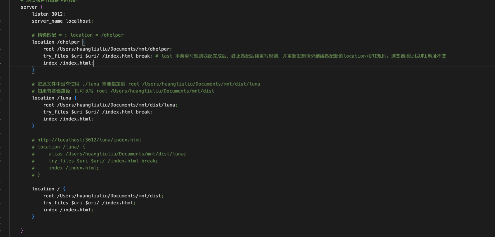

nginx 中的 try_files 指令用于尝试按照指定的顺序查找文件或资源，直到找到第一个存在的文件或资源为止。如果没有找到，它会执行指定的动作（如返回错误或代理到其他后端）。这是处理静态文件、SPA（单页面应用程序）路由以及避免 404 错误的一种常见方式。

try_files 语法
```nginx
try_files path1 path2 ... final_action;
```
path1, path2, ...: 依次检查的文件路径或 URI。

final_action: 如果所有路径都不存在，执行的最终动作，比如返回一个默认文件、错误页面，或代理到一个后端服务。

常见使用场

#### 1.静态文件优先
   
如果你有一个目录存放静态文件（比如图片、HTML 等），但你也希望在找不到文件时使用默认的文件或资源：
```nginx
location / {
    root /var/www/html;
    try_files $uri $uri/ /default.html;
}
```
$uri: 请求的 URI 对应的文件。


$uri/: 如果请求的是目录，查找该目录中的文件。
/default.html: 如果前面两个都没有找到，则返回 default.html。

#### 2.用于单页面应用程序 (SPA)
在处理 Vue.js 或 React 这样的单页面应用时，前端路由依赖于浏览器的 History API，所以需要让所有的路由都映射到一个 index.html 文件：

```nginx
location / {
    try_files $uri /index.html;
}
```
如果请求的文件或目录不存在，将返回 index.html，这样可以让 SPA 的前端路由接管。 

当dist下还放有子项目包，子项目包的nginx配置中 try_files 需要添加`break`防止重复定向。



localhost:3012/luna 会展示 /mnt/dist/index.html ，加上 break 后才能正常显示 mnt/dist/luna/index.html 内容，不再向下匹配

#### 3.代理请求到后端服务
你也可以将请求文件不存在的情况代理到后端服务：

```nginx
location / {
    try_files $uri $uri/ @backend;
}

location @backend {
    proxy_pass http://backend_server;
}
```
如果静态文件不存在，nginx 会将请求转发到 backend_server。

#### 返回 404 错误
可以指定在文件不存在时返回 404 错误：
```nginx
location / {
    try_files $uri $uri/ =404;
}
```
try_files 允许你优雅地处理静态文件和动态请求之间的关系，尤其适合处理静态资源与 SPA 的情况。