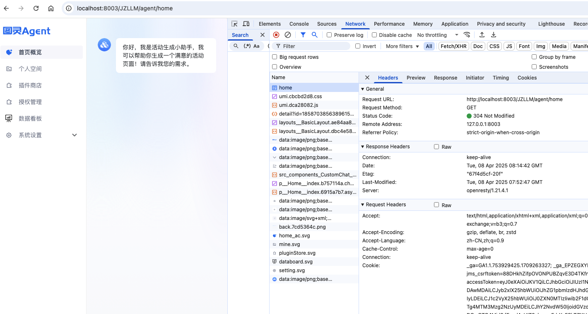
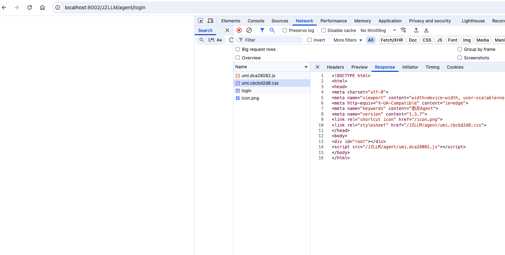
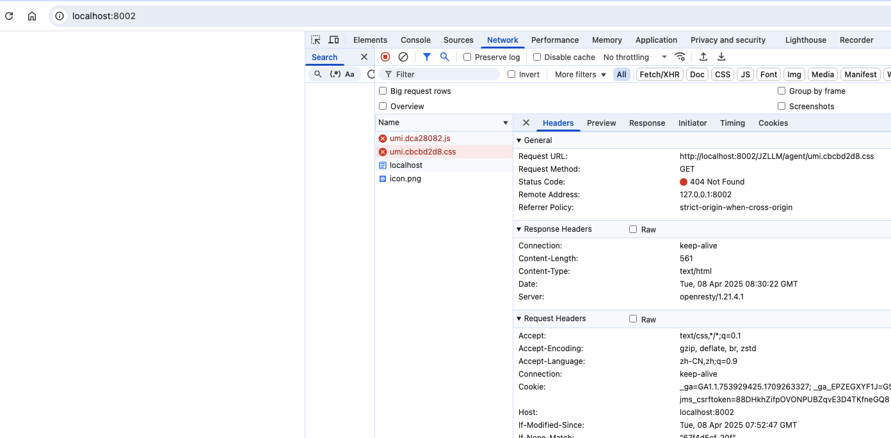
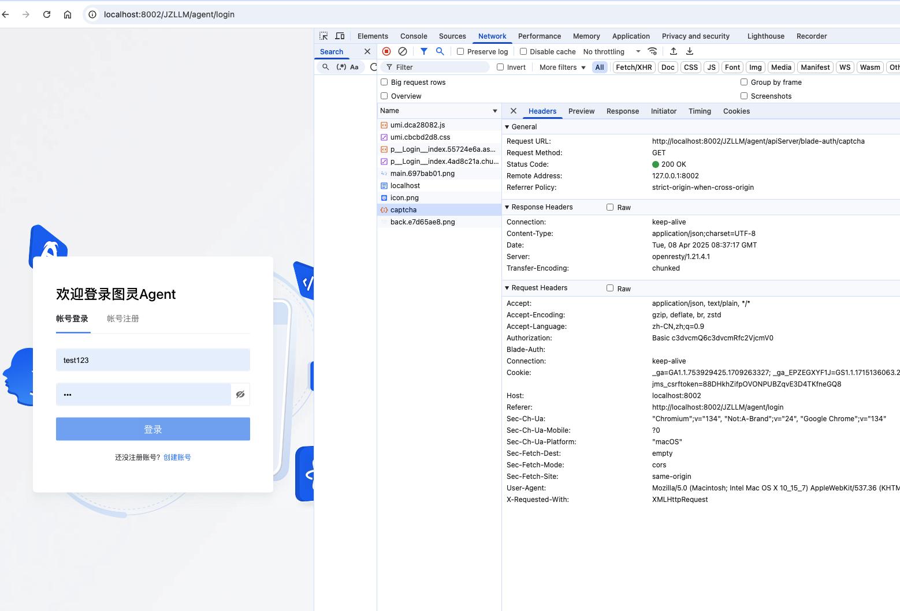
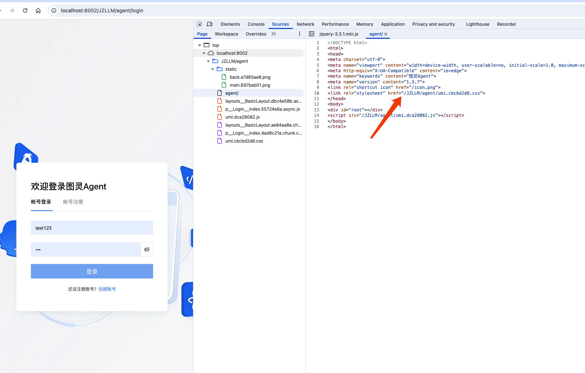
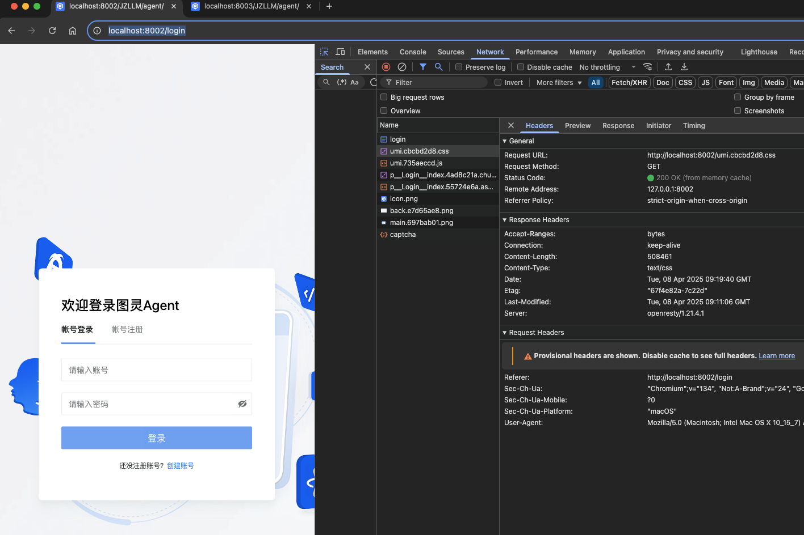
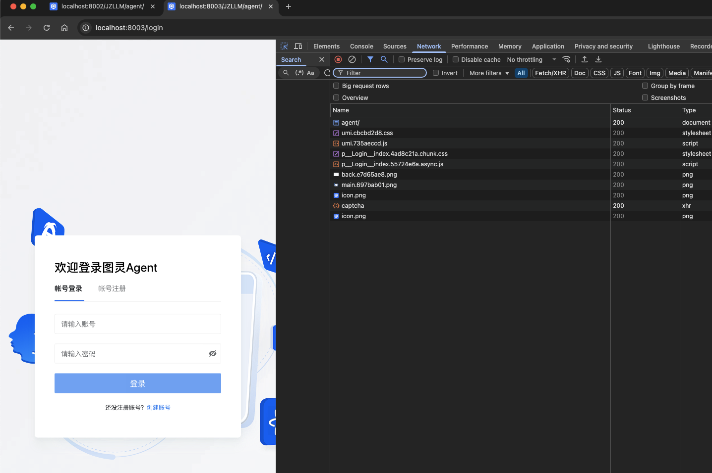

### 业务背景

项目出于安全考虑需要隐藏内部服务器ip，运维要做俩层代理，第一层是对外开放服务器的端口路由代理到内部服务器端口，第二层是内部服务器端口代理到前端项目静态文件包。

### 1.前端设置项目基础路由，运维在第一层根据基础路由代理到内部服务器地址，内部服务器代理到前端静态文件包

在umi项目的公用变量文件中设置基础路由：

```js
// /src/pages/config.js 文件
export const apiUrl_LOCAL = 'http://localhost:7001/'
export const basePath = `/JZLLM/agent/`; // 项目根路径,默认 /
export const baseURLPath = `/JZLLM/agent/`; // 接口请求根路径默认 ''
```

在 .umirc.ts 或 config/config.ts 中设置：
```ts
export default defineConfig({
  base: basePath, // 基础路由，需要以 / 开始和结尾
  publicPath: basePath, // 公共文件路径 与base 设置需一致
  // ……
  proxy: {
    // 本地调试时，根据接口基础路径做代理
    '/JZLLM/agent/apiServer': {
        target: `${apiUrl_LOCAL}`,
        changeOrigin: true,
        pathRewrite: { '^/JZLLM/agent/apiServer': '' },
    }, 
  }
})
```

在ajax配置文件 request.js 声明接口基础路径
```js
import { baseURLPath } from '@/config/index';
const requests = {
  // 统一的请求设定
  timeout: 600000,
  baseURL: baseURLPath,
}
```
或者也可以在 responseInterceptors 中处理
```js
  // 请求拦截器
  requestInterceptors: [
    (config: AxiosRequestConfig) => {
      // 拦截请求配置，进行个性化处理。
      if (!config.url.startsWith('http')) {
        config.url = `${baseURLPath}${config.url}`;
      }
      return { ...config, headers };
    },
  ]
```
项目中有些需要使用到 location.pathname 路径进行判断处理，可以添加一个公用处理方法
```js
import { basePath } from '@/config';

// 替换路径中的basePath为/
export const getRelativePath = (path: string) => {
  return `${path.replace(basePath, '/')}`;
};

// 为路径中添加basePath
export const setFullPath = (path: string) => {
  return `${basePath}${path}`;
};
```
nginx示例

```nginx
http {
    # 第一层8003
    server {
        listen 8003;
        server_name localhost;

        location /JZLLM/agent/ {
            proxy_pass http://localhost:8002/;
        }
    }

     # 第二层8002
    server {
        listen 8002;
        server_name localhost;

        location / {
           root /Users/huangliuliu/Documents/Code/Bonc/llm-agent-local/dist;
	       try_files $uri $uri/ /index.html;
        }

        location /apiServer/ {
            proxy_pass http://10.131.129.2:8087/;
            proxy_connect_timeout 300s;
            proxy_send_timeout 300s;
            proxy_read_timeout 300s;
        }
    }
}
```
本地预览地址 `ttp://localhost:8003/JZLLM/agent/`



项目公共文件 `
http://localhost:8003/JZLLM/agent//svg/home.svg`, 接口请求 `http://localhost:8003/JZLLM/agent/apiServer/blade-agent/bot/list?current=1&size=48` 都可以成功


但是这种情况直接访问 8002 端口，页面空白




会发现本地所有的文件资源请求都会代理到 index.html 文件，这是因为当从8002 端口发出资源请求`http://localhost:8002/JZLLM/agent/umi.cbcbd2d8.css`，会被nginx中的 / location拦截，`try_files` 俩次匹配路径后没有对应文件，返回index.html 文件内容，如果没有 `try_files` 指令就会返回 404。



此时若要时 8002 端口访问成功，可以在 8002 端口下添加 `/JZLLM/agent` 处理


```nginx
    server {
        listen 8002;
        server_name localhost;

        # 对接8003端口前端静态资源文件请求处理
        location / {
           root /Users/huangliuliu/Documents/Code/Bonc/llm-agent-local/dist;
	       try_files $uri $uri/ /index.html;
        }

        # 对接8002本地端口前端静态资源文件请求处理，alias舍弃前缀路由 
        location /JZLLM/agent/ {
           alias /Users/huangliuliu/Documents/Code/Bonc/llm-agent-local/dist/;
	       try_files $uri $uri/ /index.html;
        }

        # 对接8002本地前端接口请求处理，因为都含有 apiServer，优先级提前
        location /JZLLM/agent/apiServer/ {
            proxy_pass http://10.131.129.2:8087/;
            proxy_connect_timeout 300s;
            proxy_send_timeout 300s;
            proxy_read_timeout 300s;
        }

        # 对接8003端口前端接口请求处理
        location /apiServer/ {
            proxy_pass http://10.131.129.2:8087/;
            proxy_connect_timeout 300s;
            proxy_send_timeout 300s;
            proxy_read_timeout 300s;
        }
    }
```



静态资源为什么是 `http://localhost:8002/JZLLM/agent/umi.cbcbd2d8.css` ，因为在前端设置了基础路由是 `/JZLLM/agent`，会更改index.html文件中的href地址，发出的请求就是访问ip+端口+href地址：`http://localhost:8002/JZLLM/agent/umi.cbcbd2d8.css`, `JZLLM/agent` 会被 8002 下的代理拦截，alias 会去掉前缀路由，实际请求路径是 `http://localhost:8002/Users/huangliuliu/Documents/Code/Bonc/llm-agent-local/dist/umi.cbcbd2d8.css`

接口请求则会被 8002 下的 `/JZLLM/agent/apiServer/` 拦截正确转发



8003访问也不会被影响


### 2. 前端不设置基础路由，由nginx添加基础路由

```nginx
  server {
        listen 8003;
        server_name localhost;

        # 将设置的路由转发到 
        location /JZLLM/agent/ {
            proxy_pass http://localhost:8002;
        }

        # 处理静态资源请求
        location / {
            proxy_pass http://localhost:8002/;
        }
   }

   server {
        listen 8002;
        server_name localhost;

        # 将设置的路由转发到 
        location /JZLLM/agent/ {
           root /Users/huangliuliu/Documents/Code/Bonc/llm-agent-local/dist/;
           index index.html;
	         try_files $uri $uri/ /index.html;
        }

        # 处理静态资源请求
        location / {
            root /Users/huangliuliu/Documents/Code/Bonc/llm-agent-local/dist/;
	        try_files $uri $uri/ /index.html;
        }

         # 处理接口请求
        location /apiServer/ {
            proxy_pass http://10.131.129.2:8087/;
            proxy_connect_timeout 300s;
            proxy_send_timeout 300s;
            proxy_read_timeout 300s;
        }

    }
```

访问 `http://localhost:8002/JZLLM/agent/`页面：



访问 `http://localhost:8003/JZLLM/agent/`页面：



会发现俩种请求，最后都被前端自己的路由校验拦截后重定向到 登录页面。这是因为前端路由（无论是 React Router、Vue Router、或其他）是跑在浏览器端的，它并不知道你 Nginx 加了 /JZLLM/agent 前缀。

1. 当你访问 /JZLLM/agent/home，浏览器去请求这个地址。

2. Nginx 映射到 /index.html，前端接管路由。

3. 但前端路由逻辑是基于 / 且路由中也没有 /JZLLM/agent 路径，所以会被重定向到登录页面，如果是已登录状态则会跳往 404 页面。

4. 刷新或者跳转也会丢失 /JZLLM/agent 前缀。
   
5. 如果是单路径项目倒是可以这样做的

6. 多路径项目则是 前端配置 basename / publicPath + Nginx 映射，让前端保留路径前缀
   
  