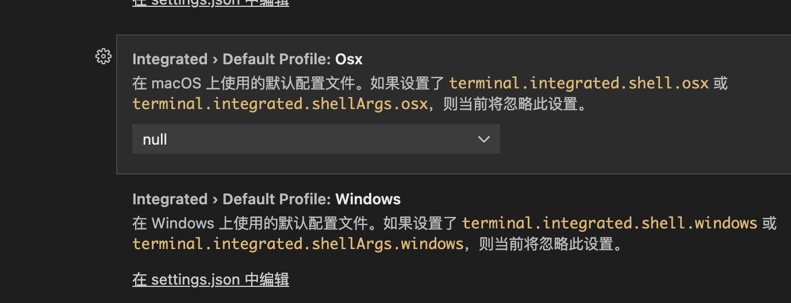

平时是使用 nvm 包管理电脑 node 版本，因个别项目依赖配置不同需要切换node版本，通过以下命令切换版本
```
nvm alias default ***

nvm use defalut
```
但是在 vs code 终端的新窗口查询当前 node 版本并没有改变，但是在苹果自己的终端程序窗口或者iterm窗口查看是 ok 的，之后进行了几次默认版本的更换还是不行🙅

查阅资料发现需要在 vscode 设置添加更改，直接搜索出的 defaultSetting 只支持读不支持写，所以需要在具体位置

更改位置：打开vscode界面 > 设置  >  功能  >  终端  >  翻阅查询 integrated 项选择在 setting.json编辑



打开后，在右边栏中添加
```
{
    ………………
    "git.confirmSync": false,
    "git.autofetch": true,
    "workbench.settings.openDefaultSettings": true,
    ………………
    "terminal.integrated.shellArgs.osx": [],
}
```
保存退出vscode，然后重新打开vscode 查询应该是生效的，再次查看 defaultSetting 中的 "terminal.integrated.shellArgs.osx" 也变为：
```
{
    ………………
    "terminal.integrated.shellArgs.osx": ["-l"],
}
```
同理，window 或者 linux 系统也可以更改对应的设置
```
// windows
"terminal.integrated.shellArgs.osx": [],

// linux
"terminal.integrated.shellArgs.osx": [],
```

或者参照最新的方法 在 `terminal.integrated.profiles.osx#` 中创建一个终端配置文件，并将其配置文件名称设置为 `#terminal.integrated.defaultProfile.osx` 中的默认值。此操作当前将优先于新的配置文件设置，但将来会发生更改。在 macOS 终端上时要使用的命令行参数。[阅读关于配置 shell 的详细信息](https://code.visualstudio.com/docs/editor/integrated-terminal#_terminal-profiles)。

或者配置 zrcsh 启动脚本，执行 nvm.sh 命令
